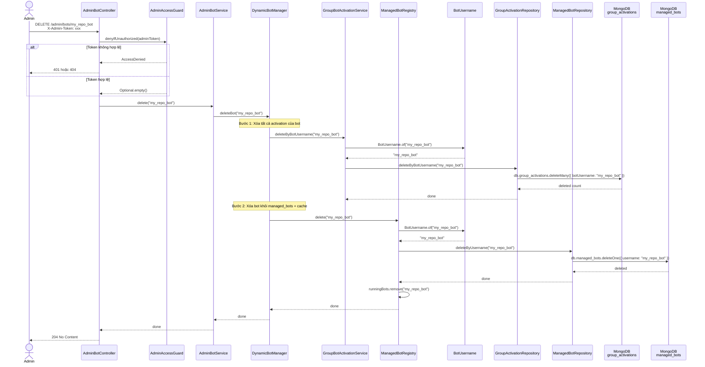

# DELETE /admin/bots/{username} — Xóa bot

## Mục đích

Xóa bot khỏi hệ thống. Xóa luôn tất cả group activation liên quan — các group đã `/add` bot này sẽ không còn nhận thông báo.

## Request

```http
DELETE /admin/bots/{username}
X-Admin-Token: <ADMIN_TOKEN>
```

| Path param | Mô tả |
|---|---|
| `username` | Username bot cần xóa |

Không có request body.

## Response

**204 No Content** — xóa thành công (không có body).

**401 Unauthorized:**

```json
{ "error": "unauthorized" }
```

**404 Not Found** (admin API disabled):

```json
{ "error": "admin api disabled" }
```

## Sequence Diagram



## Business rules

1. **Cascade delete**: xóa bot → xóa tất cả activation trong `group_activations` có `botUsername` khớp
2. **Thứ tự xóa**: activation trước, bot sau (tránh orphan activation)
3. **Cache cleanup**: bot bị remove khỏi `runningBots` (ConcurrentHashMap)
4. **Idempotent**: xóa bot không tồn tại không gây lỗi, vẫn trả `204`
5. **Không thể undo**: sau khi xóa, phải tạo lại bot + đăng ký lại webhook + `/add` lại trong group

## Tác động

```
Trước khi xóa:
├── managed_bots: { username: "my_repo_bot", token: "...", enabled: true }
├── group_activations: [
│     { botUsername: "my_repo_bot", chatId: -100111, active: true },
│     { botUsername: "my_repo_bot", chatId: -100222, active: true }
│   ]
└── runningBots cache: { "my_repo_bot": ManagedBot{...} }

Sau khi xóa:
├── managed_bots: (không còn document)
├── group_activations: (không còn document cho bot này)
└── runningBots cache: (không còn entry)
```
