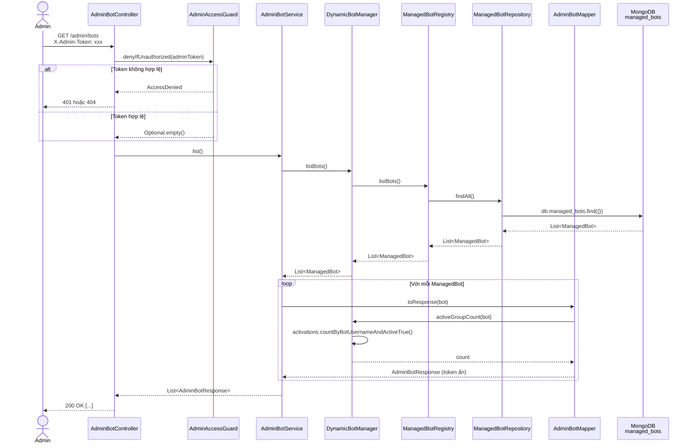

# GET /admin/bots — Lấy danh sách tất cả bot

## Mục đích

Trả về danh sách tất cả bot đang được quản lý trong MongoDB, bao gồm cả bot enabled và disabled. Dùng để admin kiểm tra trạng thái hệ thống.

## Request

```http
GET /admin/bots
X-Admin-Token: <ADMIN_TOKEN>
```

Không có request body.

## Response

**200 OK:**

```json
[
  {
    "id": "685be...",
    "username": "my_repo_bot",
    "enabled": true,
    "githubRepo": "owner/repo",
    "hasToken": true,
    "hasTelegramWebhookSecret": true,
    "hasGithubWebhookSecret": true,
    "telegramWebhookPath": "/telegram/webhook/my_repo_bot",
    "githubWebhookPath": "/github/webhook/my_repo_bot",
    "activeGroups": 3,
    "createdAt": "2026-06-25T04:30:00Z",
    "updatedAt": "2026-06-25T04:45:00Z"
  },
  {
    "id": "685bf...",
    "username": "another_bot",
    "enabled": false,
    "githubRepo": "owner/other-repo",
    "hasToken": true,
    "hasTelegramWebhookSecret": false,
    "hasGithubWebhookSecret": true,
    "telegramWebhookPath": "/telegram/webhook/another_bot",
    "githubWebhookPath": "/github/webhook/another_bot",
    "activeGroups": 0,
    "createdAt": "2026-06-25T05:00:00Z",
    "updatedAt": "2026-06-25T05:00:00Z"
  }
]
```

**401 Unauthorized:**

```json
{ "error": "unauthorized" }
```

**404 Not Found** (admin API disabled):

```json
{ "error": "admin api disabled" }
```

## Sequence Diagram



## Business rules

1. **Trả tất cả bot**: bao gồm cả `enabled=false`, admin cần thấy toàn cảnh
2. **Active group count**: mỗi bot response kèm số group đang active (`activeGroups`)
3. **Token ẩn**: response không bao giờ chứa token/secret thật
4. **Danh sách rỗng hợp lệ**: nếu chưa có bot nào → trả `[]`
