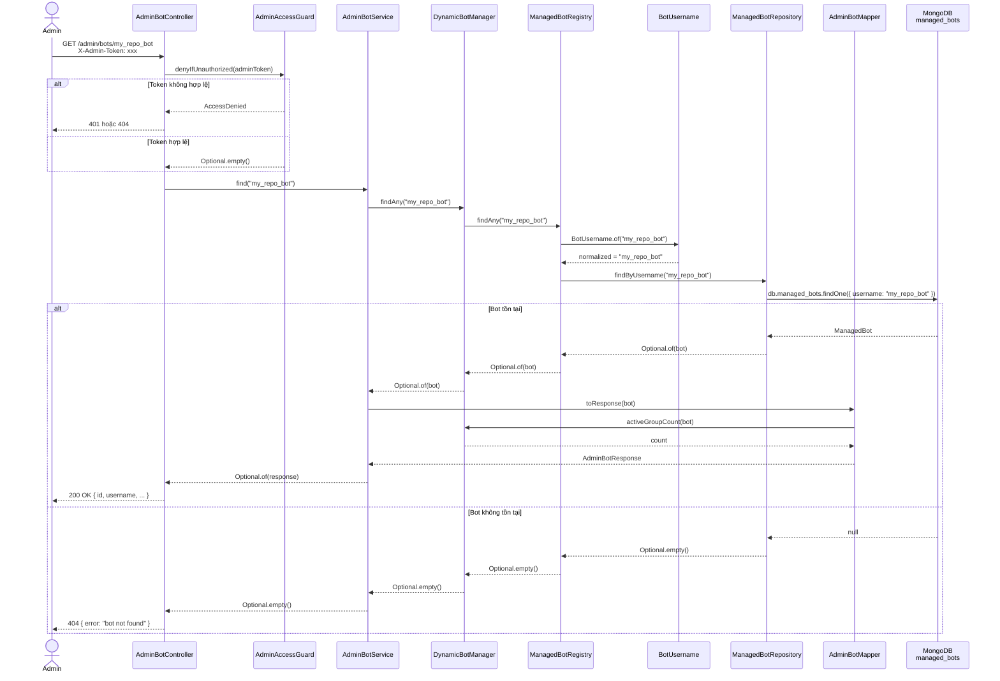

# GET /admin/bots/{username} — Lấy thông tin một bot

## Mục đích

Trả về thông tin chi tiết của một bot theo username. Dùng để admin kiểm tra trạng thái cấu hình, xác nhận bot đã có đủ token/secret chưa.

## Request

```http
GET /admin/bots/{username}
X-Admin-Token: <ADMIN_TOKEN>
```

| Path param | Mô tả |
|---|---|
| `username` | Username bot (vd: `my_repo_bot`). Tự động normalize: strip `@`, lowercase |

## Response

**200 OK:**

```json
{
  "id": "685be...",
  "username": "my_repo_bot",
  "enabled": true,
  "githubRepo": "owner/repo",
  "hasToken": true,
  "hasTelegramWebhookSecret": true,
  "hasGithubWebhookSecret": true,
  "telegramWebhookPath": "/telegram/webhook/my_repo_bot",
  "githubWebhookPath": "/github/webhook/my_repo_bot",
  "activeGroups": 3,
  "createdAt": "2026-06-25T04:30:00Z",
  "updatedAt": "2026-06-25T04:45:00Z"
}
```

**404 Not Found** — bot không tồn tại:

```json
{ "error": "bot not found" }
```

**401 Unauthorized:**

```json
{ "error": "unauthorized" }
```

## Sequence Diagram



## Business rules

1. **findAny**: tìm cả bot enabled lẫn disabled (khác với `findEnabled` chỉ dùng cho webhook)
2. **Username normalize**: path `/@My_Bot` hay `/my_repo_bot` đều được chuẩn hóa trước khi query
3. **Token ẩn**: response chỉ trả `hasToken`, `hasTelegramWebhookSecret`, `hasGithubWebhookSecret`
4. **Active groups**: kèm đếm số group đang nhận thông báo từ bot này
