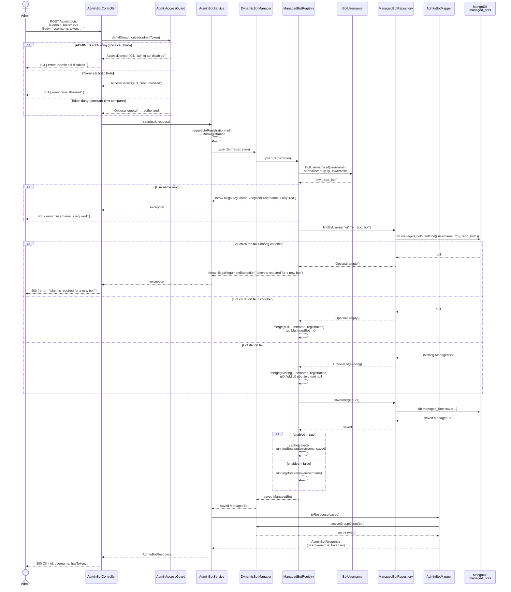

# POST /admin/bots — Tạo hoặc cập nhật bot

## Mục đích

Tạo bot mới hoặc cập nhật bot đã tồn tại trong kho MongoDB. Đây là bước đầu tiên để đưa bot vào hệ thống — trước khi đăng ký webhook Telegram/GitHub.

## Request

```http
POST /admin/bots
Content-Type: application/json
X-Admin-Token: <ADMIN_TOKEN>
```

**Body:**

```json
{
  "username": "my_repo_bot",
  "token": "123456789:ABC-def-ghi",
  "telegramWebhookSecret": "random-telegram-secret",
  "githubRepo": "owner/repo",
  "githubWebhookSecret": "random-github-secret",
  "enabled": true
}
```

| Field | Bắt buộc | Mô tả |
|---|---|---|
| `username` | Có (tạo mới) | Username Telegram bot (không có `@`) |
| `token` | Có (tạo mới) | Token từ BotFather |
| `telegramWebhookSecret` | Không | Secret verify Telegram webhook header |
| `githubRepo` | Không | Repo GitHub dạng `owner/repo` |
| `githubWebhookSecret` | Không | Secret verify chữ ký GitHub |
| `enabled` | Không | Default `true`. `false` để tắt bot |

## Response

**200 OK** — Bot đã được tạo/cập nhật:

```json
{
  "id": "685be...",
  "username": "my_repo_bot",
  "enabled": true,
  "githubRepo": "owner/repo",
  "hasToken": true,
  "hasTelegramWebhookSecret": true,
  "hasGithubWebhookSecret": true,
  "telegramWebhookPath": "/telegram/webhook/my_repo_bot",
  "githubWebhookPath": "/github/webhook/my_repo_bot",
  "activeGroups": 0,
  "createdAt": "2026-06-25T04:30:00Z",
  "updatedAt": "2026-06-25T04:30:00Z"
}
```

**400 Bad Request:**

```json
{ "error": "username is required" }
{ "error": "token is required for a new bot" }
```

**401 Unauthorized:**

```json
{ "error": "unauthorized" }
```

**404 Not Found** (admin API disabled):

```json
{ "error": "admin api disabled" }
```

## Sequence Diagram



## Business rules

1. **Username chuẩn hóa**: `@My_Bot` → `my_bot` (strip `@`, lowercase)
2. **Upsert logic**: nếu bot cùng username đã tồn tại → merge field mới vào, field `null` giữ giá trị cũ
3. **Token bắt buộc khi tạo mới**: bot lần đầu phải có token, lần sau update có thể bỏ qua
4. **Cache registry**: bot enabled được cache vào `ConcurrentHashMap` để lookup nhanh khi webhook đến
5. **Response ẩn token**: không bao giờ trả `token`, `tgWebhookSecret`, `ghWebhookSecret` thật — chỉ trả `hasToken`, `hasTelegramWebhookSecret`, `hasGithubWebhookSecret`
