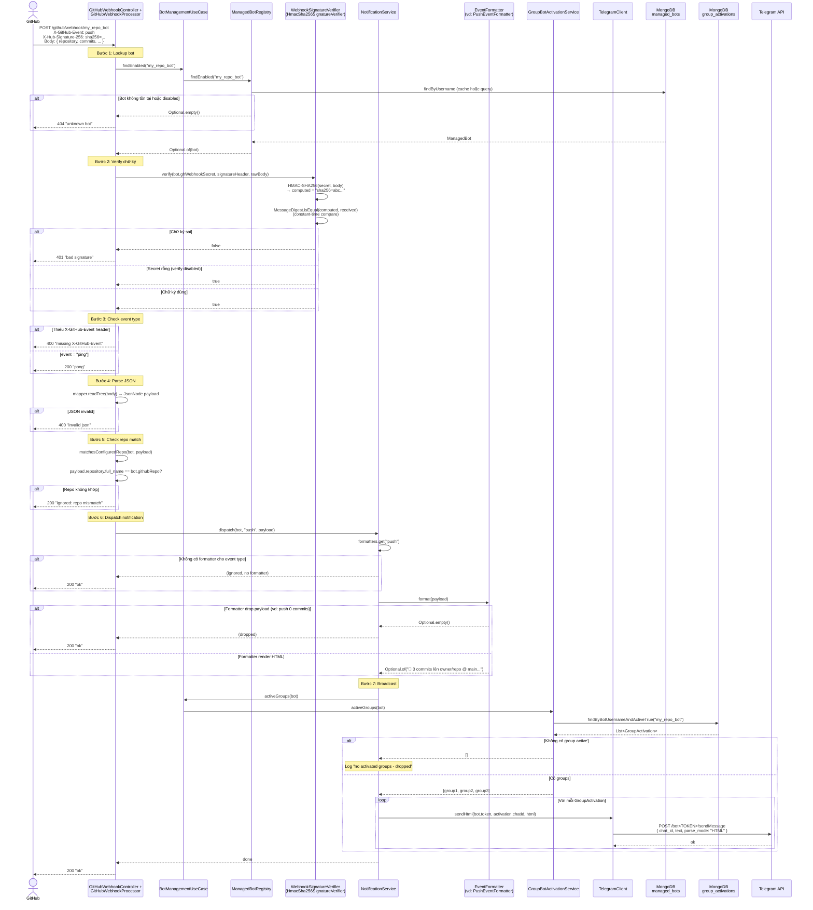
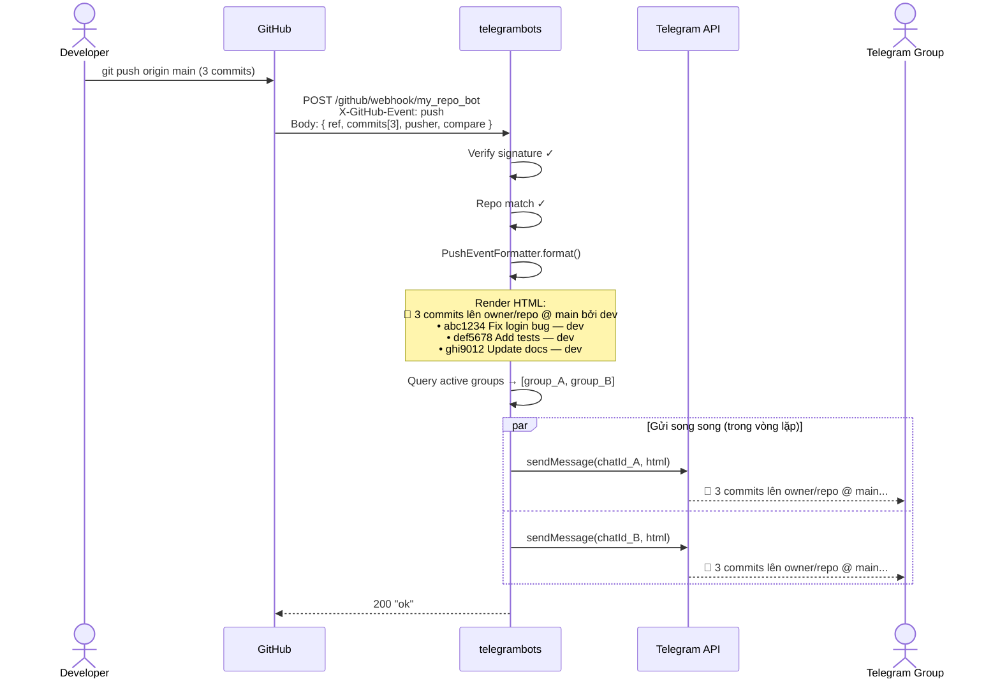

# POST /github/webhook/{botUsername} — Nhận GitHub event

## Mục đích

Endpoint mà GitHub gọi khi repo có event (push, PR, issue...). Backend verify chữ ký HMAC-SHA256, kiểm tra repo khớp, format message, và broadcast đến tất cả Telegram group đã kích hoạt bot.

## Request

```http
POST /github/webhook/{botUsername}
Content-Type: application/json
X-GitHub-Event: push
X-Hub-Signature-256: sha256=abc123...
X-GitHub-Delivery: 72d3162e-cc78-11e3-81ab-4c9367dc0958
```

| Header | Mô tả |
|---|---|
| `X-GitHub-Event` | Loại event: `push`, `pull_request`, `issues`, `issue_comment`, `release`, `star`, `workflow_run` |
| `X-Hub-Signature-256` | Chữ ký HMAC-SHA256 của body, verify bằng `githubWebhookSecret` |
| `X-GitHub-Delivery` | UUID duy nhất cho mỗi delivery (dùng log/debug) |

| Path param | Mô tả |
|---|---|
| `botUsername` | Username bot. Key để lookup bot + secret trong MongoDB |

**Body**: JSON payload từ GitHub (khác nhau theo event type).

## Response

| Status | Body | Điều kiện |
|---|---|---|
| `200` | `"pong"` | Event = `ping` (GitHub test delivery) |
| `200` | `"ok"` | Event xử lý thành công |
| `200` | `"ignored: repo mismatch"` | Repo trong payload không khớp `githubRepo` của bot |
| `400` | `"missing X-GitHub-Event"` | Thiếu header event |
| `400` | `"invalid json"` | Body không parse được JSON |
| `401` | `"bad signature"` | Chữ ký HMAC-SHA256 sai |
| `404` | `"unknown bot"` | Bot không tồn tại hoặc disabled |

## Sequence Diagram — Luồng chính



---

## Ví dụ: Push event flow chi tiết



---

## Các event formatter có sẵn

| Event | Formatter | Mô tả | Drop khi |
|---|---|---|---|
| `push` | `PushEventFormatter` | Liệt kê commits, branch, pusher | 0 commits (branch create/delete) |
| `pull_request` | `PullRequestEventFormatter` | PR opened/closed/merged, title, URL | — |
| `issues` | `IssueEventFormatter` | Issue opened/closed, title, URL | — |
| `issue_comment` | `IssueCommentEventFormatter` | Comment trên issue, nội dung, URL | — |
| `release` | `ReleaseEventFormatter` | Release published, tag, URL | — |
| `star` | `StarEventFormatter` | User star/unstar repo | — |
| `workflow_run` | `WorkflowRunEventFormatter` | CI/CD workflow completed, status | — |

## Business rules

1. **Signature verification**: HMAC-SHA256 + constant-time compare. Secret rỗng → skip verify (dev mode)
2. **Repo match**: nếu `bot.githubRepo` rỗng → accept all repos. Nếu có giá trị → phải khớp `payload.repository.full_name` (case-insensitive)
3. **Ping event**: GitHub gửi `ping` khi đăng ký webhook lần đầu → trả `"pong"`, không dispatch
4. **No formatter**: event type không có formatter (vd: `fork`) → bỏ qua, trả `200`
5. **Formatter drop**: formatter trả `Optional.empty()` → bỏ qua (vd: push 0 commits)
6. **No active groups**: có message nhưng không có group nào `/add` → log, không gửi
7. **Broadcast failure isolation**: nếu gửi thất bại cho 1 group, vẫn tiếp tục gửi các group còn lại
8. **Luôn trả 200/ok**: sau khi verify thành công, mọi lỗi xử lý đều catch → trả 200 để GitHub không retry
