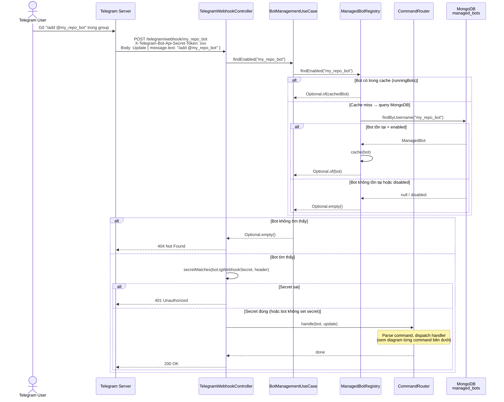
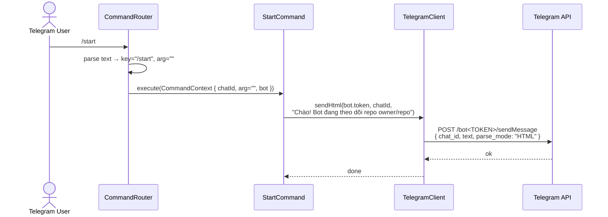
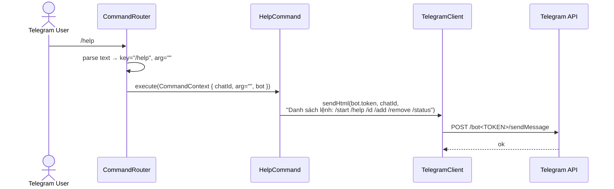
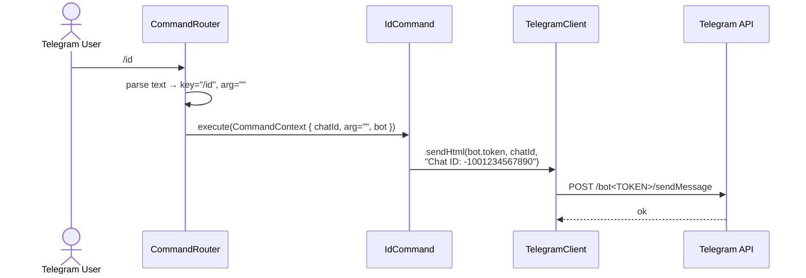
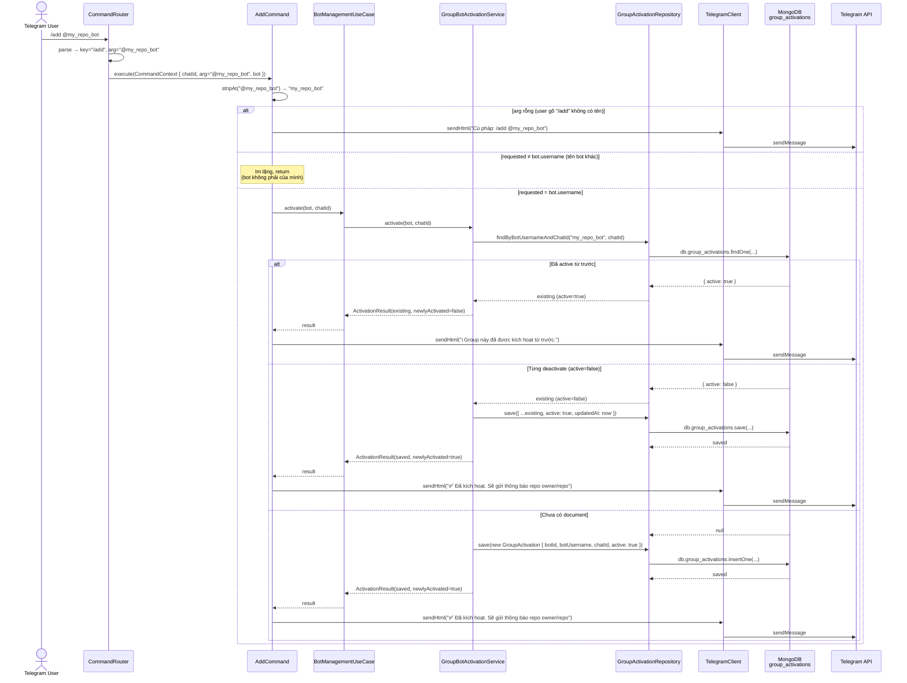
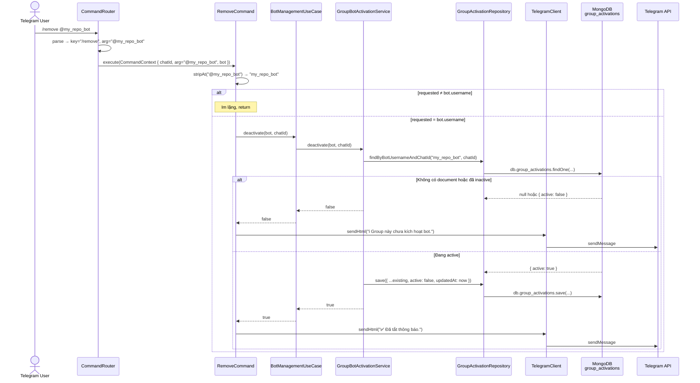
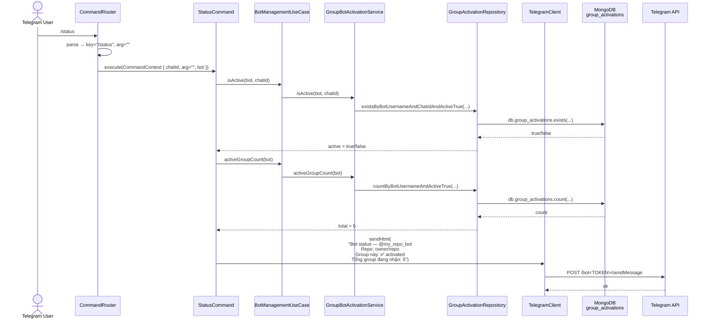

# POST /telegram/webhook/{botUsername} — Nhận Telegram update

## Mục đích

Endpoint mà Telegram gọi khi có message mới gửi đến bot. Backend lookup bot từ URL path, verify secret, parse command, và dispatch đến handler tương ứng.

## Request

```http
POST /telegram/webhook/{botUsername}
Content-Type: application/json
X-Telegram-Bot-Api-Secret-Token: <telegramWebhookSecret>
```

| Path param | Mô tả |
|---|---|
| `botUsername` | Username bot (vd: `my_repo_bot`). Key để lookup bot trong registry |

**Body** (Telegram Update):

```json
{
  "update_id": 123456789,
  "message": {
    "message_id": 1,
    "chat": {
      "id": -1001234567890,
      "type": "group"
    },
    "from": {
      "id": 111222333,
      "first_name": "Admin"
    },
    "text": "/add @my_repo_bot",
    "date": 1719300000
  }
}
```

## Response

- **200 OK** — luôn trả 200 (kể cả khi xử lý lỗi) để Telegram không retry
- **404 Not Found** — bot không tồn tại hoặc disabled
- **401 Unauthorized** — secret token sai

## Sequence Diagram — Luồng chung



---

## Command: /start

Gửi lời chào và repo bot đang theo dõi.



---

## Command: /help

Liệt kê danh sách lệnh có sẵn.



---

## Command: /id

Trả về Telegram chat ID của group/user hiện tại.



---

## Command: /add @bot — Kích hoạt bot trong group



---

## Command: /remove @bot — Tắt thông báo trong group



---

## Command: /status — Trạng thái bot trong group



## Business rules

1. **Luôn trả 200**: kể cả khi command handler throw exception — tránh Telegram retry vô hạn
2. **Secret optional**: nếu bot không set `tgWebhookSecret` → bỏ qua verify (dev mode)
3. **Command routing**: chỉ xử lý message bắt đầu bằng `/`, các message thường bị bỏ qua
4. **Bot suffix strip**: Telegram gửi `/start@my_repo_bot` trong group → strip `@my_repo_bot` để match key `/start`
5. **Multi-bot isolation**: `/add @bot_a` chỉ kích hoạt `bot_a`, `bot_b` nhận cùng message nhưng im lặng
6. **Unknown command**: command không có handler → log debug, không trả lời user
