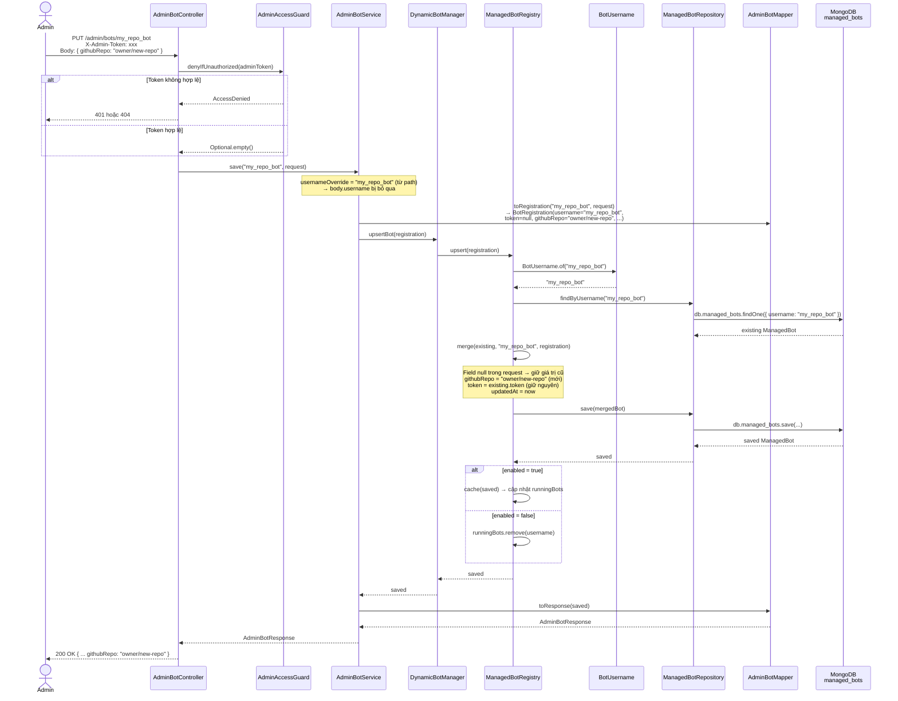

# PUT /admin/bots/{username} — Cập nhật bot theo username trên path

## Mục đích

Cập nhật một hoặc nhiều field của bot đã tồn tại. Khác với `POST /admin/bots`, endpoint này lấy username từ path thay vì body — cho phép body chỉ chứa các field cần thay đổi.

## Request

```http
PUT /admin/bots/{username}
Content-Type: application/json
X-Admin-Token: <ADMIN_TOKEN>
```

| Path param | Mô tả |
|---|---|
| `username` | Username bot trên path (tự động normalize) |

**Body** (tất cả field đều optional khi bot đã tồn tại):

```json
{
  "githubRepo": "owner/new-repo",
  "enabled": true
}
```

| Field | Mô tả |
|---|---|
| `token` | Đổi token bot |
| `telegramWebhookSecret` | Đổi Telegram webhook secret |
| `githubRepo` | Đổi repo GitHub theo dõi |
| `githubWebhookSecret` | Đổi GitHub webhook secret |
| `enabled` | Bật/tắt bot |

## Response

**200 OK:**

```json
{
  "id": "685be...",
  "username": "my_repo_bot",
  "enabled": true,
  "githubRepo": "owner/new-repo",
  "hasToken": true,
  "hasTelegramWebhookSecret": true,
  "hasGithubWebhookSecret": true,
  "telegramWebhookPath": "/telegram/webhook/my_repo_bot",
  "githubWebhookPath": "/github/webhook/my_repo_bot",
  "activeGroups": 3,
  "createdAt": "2026-06-25T04:30:00Z",
  "updatedAt": "2026-06-26T09:00:00Z"
}
```

**400 Bad Request:**

```json
{ "error": "username is required" }
{ "error": "token is required for a new bot" }
```

**401 / 404:** tương tự các endpoint admin khác.

## Sequence Diagram



## Business rules

1. **Username từ path**: `PUT /admin/bots/my_repo_bot` → username = `"my_repo_bot"`, body.username bị bỏ qua
2. **Partial update**: field `null` trong body → giữ giá trị cũ trong MongoDB (merge logic)
3. **Tạo mới cũng được**: nếu bot chưa tồn tại, `PUT` cũng tạo mới (nhưng cần `token`)
4. **Cache sync**: khi `enabled` thay đổi, registry cache (`runningBots`) được cập nhật ngay
5. **updatedAt tự cập nhật**: luôn set `updatedAt = Instant.now()`

## So sánh với POST /admin/bots

| | POST /admin/bots | PUT /admin/bots/{username} |
|---|---|---|
| Username từ | body.username | path parameter |
| Use-case chính | Tạo bot mới | Cập nhật bot có sẵn |
| Partial update | Có (nếu bot tồn tại) | Có |
