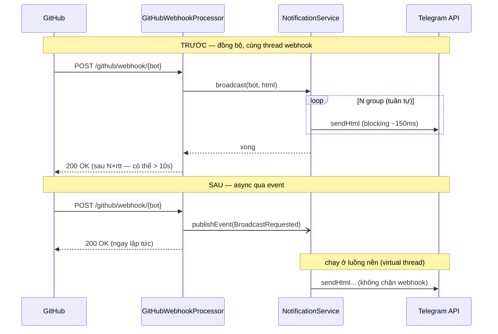

# Đề xuất: Async broadcast bằng application event

> **Trạng thái: ĐỀ XUẤT — chưa triển khai.** File này mô tả cách làm + code ví dụ để review, chưa phải code thật trong repo.

Mục tiêu: bỏ bottleneck ở `NotificationService.broadcast` (gửi Telegram tuần tự, đồng bộ, ngay trên thread webhook GitHub) bằng cách **tách broadcast ra luồng nền qua application event**.

---

## 1. Vấn đề (tóm tắt)

Hiện tại `GitHubWebhookProcessor.process` gọi thẳng `notifications.broadcast(...)`, mà broadcast lại gửi Telegram **tuần tự** trong vòng `for`. Toàn bộ chạy **trên thread của request webhook GitHub**, nên:

- Broadcast lâu > 10s → GitHub timeout → **retry → trùng lặp**, fail nhiều lần → **tự tắt webhook**.
- Mỗi webhook giữ 1 worker Tomcat suốt thời gian gửi → cạn thread pool khi nhiều repo push.

→ Cần: trả `200` cho GitHub **ngay**, gửi Telegram **sau đó, ở luồng khác**.

---

## 2. Ý tưởng

Đổi lời gọi trực tiếp thành **publish event → listener nền**:

```
Trước:  GitHubWebhookProcessor ── broadcast() ──▶ NotificationService   (đồng bộ, cùng thread)

Sau:    GitHubWebhookProcessor ── publishEvent ──▶ [event]
                                                      │  (async, thread khác)
                                   NotificationService ◀── @EventListener ── broadcast()
```

Webhook trả về ngay sau khi publish (publish chỉ là đẩy vào danh sách listener, không chờ gửi Telegram).

---

## 3. Thay đổi cụ thể

### 3.1. Định nghĩa event (đặt trong module `notification`)

Event mang **id, không mang entity** (để listener tự load lại, và an toàn nếu sau này persist event):

```java
// notification/BroadcastRequested.java  — API của module notification
package com.lede.telegrambots.notification;

/** Yêu cầu broadcast một message HTML đã render tới các group active của bot. */
public record BroadcastRequested(String botUsername, String html) {}
```

> Để event trong `notification` (chứ không phải `github`) giữ `notification` đúng vai "broadcaster source-agnostic". `github` đã được phép phụ thuộc `notification` nên không cần đổi `allowedDependencies`.

### 3.2. `GitHubWebhookProcessor` — publish thay vì gọi trực tiếp

```java
// Bỏ field NotificationService, thay bằng ApplicationEventPublisher
private final ApplicationEventPublisher events;

// ... trong process(), thay:
//   renderer.render(event, payload).ifPresent(html -> notifications.broadcast(bot, html));
// bằng:
renderer.render(event, payload)
        .ifPresent(html -> events.publishEvent(new BroadcastRequested(bot.username(), html)));
```

→ `github` không còn gọi method của `notification` nữa, chỉ phát event một chiều (looser coupling).

### 3.3. `NotificationService` — lắng nghe event, chạy nền

```java
@Async
@EventListener
void onBroadcastRequested(BroadcastRequested e) {
    bots.findEnabled(e.botUsername())
        .ifPresent(bot -> broadcast(bot, e.html()));   // broadcast() giữ nguyên
}
```

### 3.4. Bật async + giới hạn luồng

```java
// config/AsyncConfig.java
@Configuration
@EnableAsync
class AsyncConfig {}
```

Trên Java 21 + Spring Boot 4, nên dùng **virtual threads** cho `@Async` (mỗi lần gửi blocking là 1 virtual thread rất rẻ):

```yaml
# application.yaml
spring:
  threads:
    virtual:
      enabled: true
```

---

## 4. ⚠️ Bẫy quan trọng: `@ApplicationModuleListener` vs `@Async @EventListener`

Spring Modulith có sẵn `@ApplicationModuleListener` (= `@Async` + `@TransactionalEventListener(AFTER_COMMIT)` + `@Transactional`). **Nhưng** nó chỉ chạy khi event được publish **bên trong một transaction**.

Luồng webhook ở đây dùng **MongoDB không bọc transaction** → `@TransactionalEventListener(AFTER_COMMIT)` sẽ **không bao giờ chạy** (event publish ngoài transaction bị bỏ qua, trừ khi `fallbackExecution = true`).

| Phương án | Hợp khi nào | Ghi chú |
|---|---|---|
| **A. `@Async @EventListener`** *(khuyến nghị cho hiện tại)* | Flow không có transaction (đúng case Mongo này) | Đơn giản, chạy nền ngay sau publish |
| **B. `@ApplicationModuleListener`** | Khi flow có `@Transactional` | Đúng "chất" Modulith, chạy sau commit |

→ **Chọn A** cho codebase hiện tại. Nếu sau này bọc transaction quanh webhook, đổi sang B.

---

## 5. (Tùy chọn) Hardening thêm

- **Gửi song song có giới hạn** trong `broadcast`: thay `for` tuần tự bằng fan-out qua executor bị chặn (5–10 luồng) → giảm tổng thời gian từ `N×rtt` xuống ~`rtt`.
- **Xử lý 429** trong [TelegramClient](../../telegrambots-infrastructure/src/main/java/com/lede/telegrambots/infrastructure/telegram/TelegramClient.java): đọc `retry_after`, retry có backoff; throttle ~30 msg/s/bot (hiện đang nuốt lỗi → mất tin).
- **Event bền vững (at-least-once)**: thêm `spring-modulith-starter-mongodb` để lưu event publication vào Mongo (outbox) → không mất thông báo khi app restart giữa chừng. Cần dùng phương án B + transaction.

---

## 6. Ảnh hưởng module & `verify()`

- `github → notification` **vẫn còn** (vì `github` tham chiếu type event `BroadcastRequested` của `notification`) → `allowedDependencies` **không đổi**, `ModularityTests.verify()` vẫn xanh.
- Quan hệ chuyển từ "gọi method" sang "phát event" → coupling lỏng hơn; Modulith nhận diện được listener.
- `NotificationService` không còn được `GitHubWebhookProcessor` gọi trực tiếp; nó phản ứng với event.

---

## 7. Test cần cập nhật

| Test | Đổi gì |
|---|---|
| `GitHubWebhookProcessorTest` | Thay mock `NotificationService` bằng mock `ApplicationEventPublisher`; với case OK assert `verify(events).publishEvent(new BroadcastRequested("my_bot", "rendered html"))` |
| (mới) `NotificationListenerTest` | Publish `BroadcastRequested` → stub `bots.findEnabled` → assert `telegram.sendHtml` được gọi đúng số group |
| (tùy chọn) integration | Dùng Modulith `Scenario` hoặc Awaitility chờ broadcast chạy nền |

---

## 8. Before / after



---

## 9. Checklist triển khai (khi quyết định làm)

```
☐ Thêm notification/BroadcastRequested.java
☐ GitHubWebhookProcessor: bỏ NotificationService, thêm ApplicationEventPublisher, publish event
☐ NotificationService: thêm @Async @EventListener onBroadcastRequested(...)
☐ config/AsyncConfig.java (@EnableAsync) + spring.threads.virtual.enabled=true
☐ Sửa GitHubWebhookProcessorTest (verify publishEvent)
☐ Thêm NotificationListenerTest
☐ ./mvnw test  → ModularityTests.verify() vẫn xanh
☐ (tùy chọn) parallel send + xử lý 429 + event outbox
```
