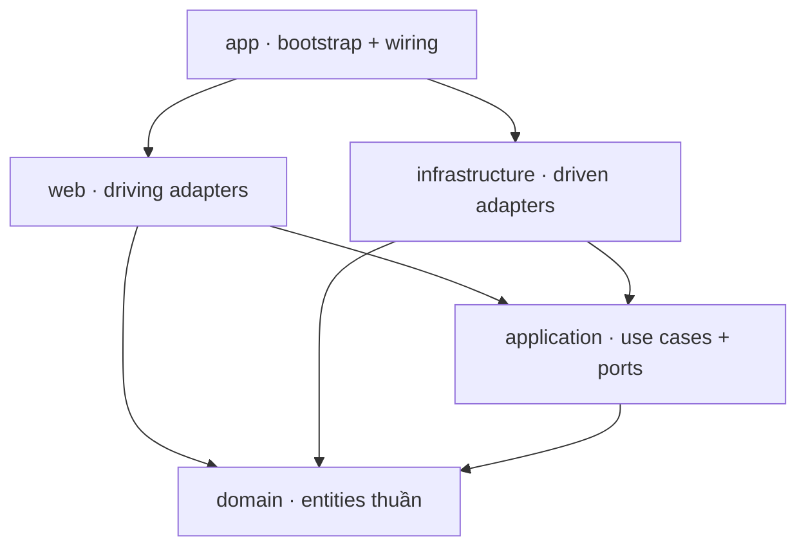

# MODULES — Clean Architecture (Onion), Maven multi-module

Codebase được module hóa theo **Clean Architecture (Onion)**: mỗi tầng là một **Maven module** riêng, và **dependency rule** (phụ thuộc luôn hướng vào trong) được **enforce ngay ở đồ thị Maven reactor** — một module chỉ "nhìn thấy" các tầng mà `pom.xml` của nó khai báo. Dự án vẫn được phân phối dưới dạng **một deployable duy nhất** (monolith) từ module `telegrambots-app`.

> Tầng trong cùng (`domain`) là Java thuần, không framework. `application` (use case + port) cũng thuần Java. Spring/Mongo/HTTP chỉ xuất hiện ở `infrastructure`, `web`, `app`.

---

## Sơ đồ phụ thuộc tầng



`domain` không phụ thuộc ai. `web` và `infrastructure` là hai tầng ngoài **ngang hàng** — không tầng nào phụ thuộc tầng kia (chúng gặp nhau qua port + wiring ở `app`).

---

## Bảng module

| Maven module | Package gốc | Trách nhiệm | Phụ thuộc (pom) |
|---|---|---|---|
| **telegrambots-domain** | `…domain.*` | Entities & value objects thuần (`ManagedBot`, `GroupActivation`, `BotUsername`, `BotDomainService`, domain events) | — |
| **telegrambots-application** | `…application.*` | Use case + outbound/inbound ports + pipeline abstraction (thuần Java) | `domain` |
| **telegrambots-infrastructure** | `…infrastructure.*` | Driven adapters: Mongo (document + repo + mapper), `TelegramClient`, HMAC verifier, event publisher, bot cache | `application` |
| **telegrambots-web** | `…admin/…github/…telegram` | Driving adapters: REST controllers, DTO, webhook pipelines, formatters, command handlers | `application`, `domain` |
| **telegrambots-app** | `…telegrambots` | Spring Boot bootstrap + composition root (wire use case thuần thành `@Bean`) | `web`, `infrastructure` |

---

## Tầng theo Clean Architecture

- **Entities (domain)** — quy tắc nghiệp vụ doanh nghiệp; record thuần, không annotation.
- **Use Cases (application)** — điều phối nghiệp vụ qua **port**:
  - *inbound port*: `BotManagementUseCase` (facade `DynamicBotManager` triển khai).
  - *outbound port*: `BotRepository`, `ActivationRepository`, `BotCache`, `TelegramGateway`, `WebhookSignatureVerifier`, `DomainEventPublisher`.
- **Interface Adapters (web)** — chuyển HTTP ⇄ use case; không chứa nghiệp vụ.
- **Frameworks & Drivers (infrastructure + app)** — Mongo/Telegram/Spring; `app` lắp ráp tất cả.

---

## Pipeline pattern (dùng chung cho mọi nghiệp vụ tuần tự)

`application.pipeline` cung cấp một abstraction generic dùng lại ở **cả** webhook lẫn business logic:

- `Step<C, R>` — một stage: `Optional<R> execute(C ctx)` (rỗng = đi tiếp, có giá trị = short-circuit).
- `Pipeline<C, R>` — chạy danh sách step theo thứ tự, trả về kết quả của step short-circuit đầu tiên.

Áp dụng:

| Pipeline | Context | Các stage |
|---|---|---|
| GitHub webhook (`web.github`) | `GitHubWebhookContext` | bot lookup → verify chữ ký → kiểm tra event → ping → parse JSON → match repo → execute handler |
| Telegram webhook (`web.telegram`) | `TelegramWebhookContext` | bot lookup → verify secret → validate message → parse command → lookup command → execute |
| Upsert bot (`application.bot`) | `UpsertBotUseCase.Context` | normalize+load → merge (domain) → persist → refresh cache → publish event |
| Delete bot (`application.bot`) | `DeleteBotUseCase.Context` | load → xoá activations → xoá bot → evict cache → publish event |

`GitHubWebhookStep`/`TelegramWebhookStep` chỉ là alias `extends Step<…>` để Spring inject đúng nhóm bean (`@Order`).

---

## Cách enforce dependency rule

Không còn dùng Spring Modulith. Biên giới được enforce bằng **đồ thị phụ thuộc Maven**:

- `domain/pom.xml` không khai báo dependency nội bộ nào → không thể tham chiếu tầng ngoài.
- `application` chỉ khai báo `domain` → không thấy `infrastructure`/`web`.
- `web` và `infrastructure` không khai báo lẫn nhau → không thể phụ thuộc chéo.

Kiểm chứng nhanh:

```bash
# domain + application không được import framework
grep -rn "import org.springframework\|com.mongodb\|tools.jackson\|jakarta\." \
  telegrambots-domain/src/main telegrambots-application/src/main
# → không có kết quả
```

---

## Cấu trúc Package nội bộ (Package-Level Modularity)

Để đảm bảo các module đóng gói tốt và không bị rò rỉ chi tiết cài đặt (encapsulation), dự án áp dụng quy tắc phân tách **Interface (Ports)** và **Implementation (Adapters)** ở cấp độ package:

1. **Các file Interface (Ports) công khai**: Được đặt trực tiếp tại thư mục gốc (root package) của module tương ứng (ví dụ: `com.lede.telegrambots.telegram` chứa `TelegramWebhookStep.java`, `com.lede.telegrambots.github` chứa `GitHubWebhookStep.java`, `com.lede.telegrambots.telegram.command` chứa `BotCommand.java`). Các module bên ngoài chỉ được giao tiếp qua các Interface này.
2. **Các file Implementation (Adapters/Concrete classes)**: Được đặt hoàn toàn trong package con tên là `.impl` (ví dụ: `com.lede.telegrambots.telegram.impl`, `com.lede.telegrambots.telegram.command.impl`, `com.lede.telegrambots.github.impl`, `com.lede.telegrambots.github.formatter.impl`, `com.lede.telegrambots.github.handler.impl`, `com.lede.telegrambots.admin.impl`). Các module khác không được phép import trực tiếp các class trong các package `.impl` này.
3. **Infrastructure Persistence**: Tách biệt lớp thực thi Mongo (`MongoBotRepository`, `MongoActivationRepository`) ở package gốc của persistence khỏi các Mongo Documents, Document Repositories, và Mappers (được ẩn đi trong `persistence.mongo.impl`).
4. **Tách biệt Pipeline Steps**: Để hạn chế việc gộp tất cả logic vào một class usecase hay một package impl khổng lồ ("cục to đùng"), toàn bộ các bước thực thi của Pipeline được chia nhỏ thành các class/record độc lập nằm trong package con `.steps` tương ứng (ví dụ: `application.bot.steps`, `application.activation.steps`, `application.notification.steps`, `telegram.steps`, `github.steps`).

---

## Quy ước khi thêm code

- **Entity/value object/nghiệp vụ thuần** → `domain` (không annotation framework).
- **Use case mới / port mới** → `application` (thuần Java); wire `@Bean` trong `UseCaseConfiguration` của `app`.
- **Adapter công nghệ mới** (DB, HTTP, queue…) → `infrastructure`, triển khai một outbound port.
- **Endpoint / controller / DTO** → `web`.
- **Phân tách Interface & Impl**: Interface công khai ở root package của module, các class implement đặt trong package con `.impl`.
- **Chia nhỏ Pipeline Steps**: Tránh khai báo các step dưới dạng inner classes hay gộp chung trong một file. Tách mỗi step thành một class/record riêng biệt đặt trong package con `.steps` của feature tương ứng.
- Cần một nghiệp vụ nhiều bước → dựng bằng `Step` + `Pipeline` của `application.pipeline`.
- Không bao giờ để `domain`/`application` import Spring/Mongo/Jackson; không để `web` import `infrastructure`.

