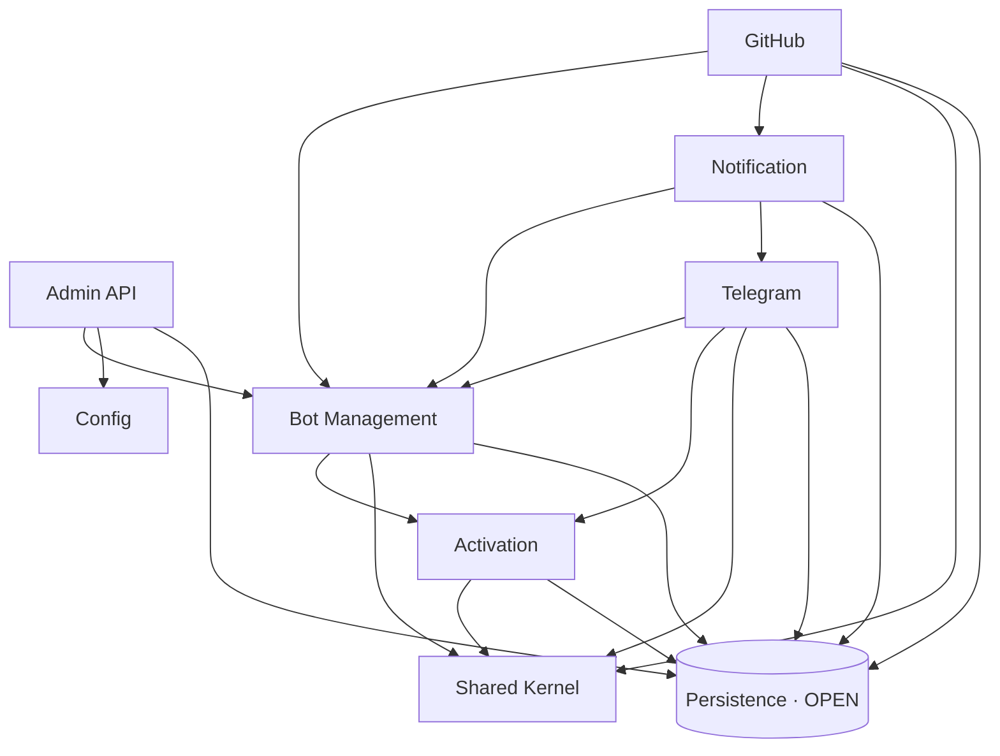

# MODULES — Modular monolith (Spring Modulith)

Codebase được module hóa dưới dạng một dự án Maven multi-module gồm 10 submodules riêng biệt, kết hợp **Spring Modulith 2.1** ở tầng runtime. Dự án được phân phối dưới dạng **một deployable duy nhất** (monolith) từ module `telegrambots-app`, nhưng biên giới giữa các module được phân tách rõ ràng ở cấu trúc thư mục/POM và được **enforce bằng test** — không module nào được chọc vào internal của module khác, không phụ thuộc ngoài `allowedDependencies` được khai báo, và không có dependency cycle.

> Mỗi sub-package trực tiếp của `com.lede.telegrambots` là một **Application Module**. Khai báo biên giới nằm ở `package-info.java` của từng module.

---

## Sơ đồ phụ thuộc module



Đồ thị **không có chu trình** (DAG). `shared`, `config`, `mongo` là lá (không phụ thuộc ai).

---

## Bảng module

| Module | Package | Trách nhiệm | allowedDependencies |
|---|---|---|---|
| **Shared Kernel** | `shared` | Value object/util thuần (`BotUsername`, `MessageFormatter`) | — |
| **Config** | `config` | `AppProperties` | — |
| **Persistence** *(OPEN)* | `mongo` | Entity records + Spring Data repositories | — |
| **Activation** | `activation` | Activate/deactivate bot theo group | `shared`, `mongo` |
| **Bot Management** | `bot` | Port `BotManagementUseCase` + facade, registry | `activation`, `shared`, `mongo` |
| **Admin API** | `admin` | REST CRUD bot, token guard | `bot`, `config`, `mongo` |
| **Telegram** | `telegram` | Webhook, `TelegramSender` port, command router | `bot`, `activation`, `shared`, `mongo` |
| **Notification** | `notification` | Broadcast HTML tới group active (source-agnostic) | `bot`, `telegram`, `mongo` |
| **GitHub** | `github` | Webhook pipeline, verify, render event, gọi broadcast | `bot`, `notification`, `shared`, `mongo` |

`mongo` là **OPEN module**: entity/repository là từ vựng persistence dùng chung, nên các feature module được phép tham chiếu trực tiếp mà không cần anti-corruption layer cho từng record.

---

## Hai cycle đã phá khi module hóa

Trước khi module hóa, có 2 chu trình khiến `verify()` fail. Đã refactor để dòng phụ thuộc chỉ đi một chiều:

### Cycle 1: `bot` ⇄ `activation`

| | Trước | Sau |
|---|---|---|
| `bot` → `activation` | dùng `ActivationResult` | giữ nguyên |
| `activation` → `bot` | dùng `bot.BotUsername` ❌ | `BotUsername` chuyển sang **`shared`** ✅ |

→ `activation → shared` (không còn trỏ ngược về `bot`).

### Cycle 2: `github` ⇄ `notification`

| | Trước | Sau |
|---|---|---|
| `github` → `notification` | gọi `dispatch(event)` | gọi `broadcast(html)` |
| `notification` → `github` | dùng `github.formatter.*` ❌ | formatter **ở lại `github`**, thêm `GitHubEventRenderer` ✅ |

→ `NotificationService` thành broadcaster generic (không biết GitHub). Render sự kiện GitHub do `GitHubEventRenderer` (module `github`) đảm nhận. Dòng phụ thuộc: `github → notification` một chiều.

---

## Cách enforce

Test [`ModularityTests`](../../telegrambots-app/src/test/java/com/lede/telegrambots/ModularityTests.java) chạy trong mỗi build:

```java
static final ApplicationModules modules = ApplicationModules.of(TelegrambotsApplication.class);

@Test
void verifiesModuleStructure() {
    modules.verify();   // fail build nếu có vi phạm biên giới / cycle
}
```

`verify()` fail khi:
- Một module dùng type nằm trong sub-package (internal) của module khác
- Một module phụ thuộc module không có trong `allowedDependencies`
- Xuất hiện dependency cycle

---

## Tài liệu sinh tự động

`writesDocumentation()` (trong `ModularityTests`) render sơ đồ + module canvas bằng `Documenter`, ghi ra:

```
target/spring-modulith-docs/
├── components.puml            # sơ đồ tổng (C4 component)
├── module-<name>.puml         # sơ đồ từng module
└── module-<name>.adoc         # module canvas (API, beans, events...)
```

Mở file `.puml` bằng PlantUML (có C4-PlantUML) để xem hình.

---

## Quy ước khi thêm code

- **API của module** = type ở package gốc của module (vd: `bot.BotManagementUseCase`). Type ở sub-package (vd: `telegram.command.*`, `admin.dto.*`) là **internal**, module khác không được dùng.
- Thêm phụ thuộc giữa 2 module → phải cập nhật `allowedDependencies` trong `package-info.java`, nếu không build fail.
- Util/value object dùng chung → đặt vào `shared`. Type persistence dùng chung → `mongo` (OPEN).
- Tránh tạo phụ thuộc ngược chiều (sẽ thành cycle); cân nhắc tách interface vào `shared` hoặc dùng broadcast/event một chiều.
