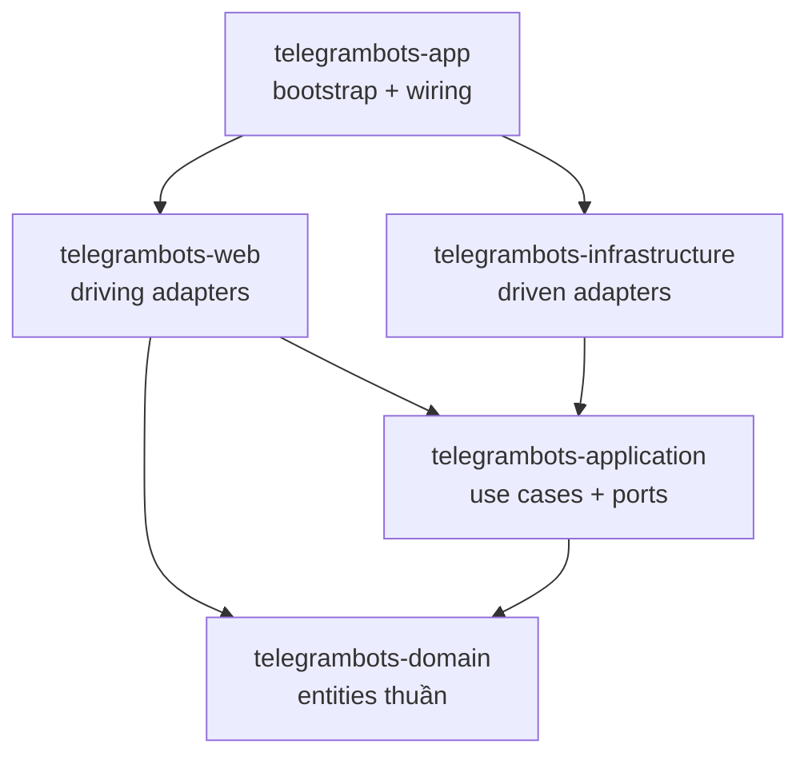

# KIẾN TRÚC QUAN HỆ PHỤ THUỘC & IMPORT GIỮA CÁC MODULE

Tài liệu này giải thích cách các module trong codebase `telegrambots` được tổ chức và phụ thuộc lẫn nhau theo **Clean Architecture (Onion)** ở cấp Maven (build-time).

---

## 1. Mô hình Maven Multi-Module theo tầng Onion

Codebase được tách thành **5 Maven module**, mỗi module là một tầng của Clean Architecture. Dependency rule (phụ thuộc hướng vào trong) được enforce **ngay bằng đồ thị Maven** — một module chỉ thấy các tầng mà `pom.xml` của nó khai báo.

1. **`telegrambots-domain`** — Entities & value objects thuần (`ManagedBot`, `GroupActivation`, `BotUsername`, `MessageFormatter`, `BotDomainService`, domain events). **Không phụ thuộc gì**, không framework.
2. **`telegrambots-application`** — Use case + port + pipeline abstraction (thuần Java). Phụ thuộc: `domain`.
3. **`telegrambots-infrastructure`** — Driven adapters: Mongo (document/repo/mapper), `TelegramClient` + `TelegramWebhookManager`, HMAC verifier, event publisher, bot cache. Phụ thuộc: `application`.
4. **`telegrambots-web`** — Driving adapters: REST controller, DTO, webhook pipeline, formatter, command handler. Phụ thuộc: `application`, `domain`.
5. **`telegrambots-app`** — Spring Boot bootstrap + composition root (wire use case thuần thành `@Bean`). Phụ thuộc: `web`, `infrastructure`.

**Parent POM** ([pom.xml](file:///D:/dev/work/telegrambots/pom.xml)) quản lý phiên bản chung và `<dependencyManagement>` cho các internal module.

---

## 2. Sơ đồ Quan hệ Phụ thuộc (Maven, build-time)



`domain` ở lõi (không phụ thuộc ai). `web` và `infrastructure` là hai tầng ngoài **ngang hàng**, không phụ thuộc lẫn nhau — chúng gặp nhau qua port (`application.port.out`) và được lắp ráp ở `app`.

---

## 3. Quy tắc import giữa các tầng

| Tầng | Được import | Tuyệt đối KHÔNG import |
|---|---|---|
| `domain` | (chỉ JDK) | Spring, Mongo, Jackson, bất kỳ tầng nào khác |
| `application` | `domain`, JDK | Spring, Mongo, Jackson, `infrastructure`, `web` |
| `infrastructure` | `application`, `domain`, Spring/Mongo | `web` |
| `web` | `application`, `domain`, Spring Web | `infrastructure` |
| `app` | tất cả | — |

Cơ chế đảo phụ thuộc (DIP): tầng trong định nghĩa **outbound port** (`BotRepository`, `ActivationRepository`, `BotCache`, `TelegramGateway`, `WebhookSignatureVerifier`, `DomainEventPublisher`); tầng `infrastructure` cung cấp adapter `@Component` triển khai. Nhờ vậy `application`/`domain` không bao giờ biết tới công nghệ cụ thể.

---

## 4. Cơ chế Tự động Xác thực (Enforcement)

Không dùng Spring Modulith. Biên giới được enforce bằng **Maven reactor**: nếu một tầng cố import tầng không khai báo trong `pom.xml`, build sẽ fail (không phân giải được symbol).

Kiểm chứng nhanh tính thuần của lõi:

```bash
grep -rn "import org.springframework\|com.mongodb\|tools.jackson\|jakarta\." \
  telegrambots-domain/src/main telegrambots-application/src/main
# → không có kết quả
```

Xem thêm [modules.md](modules.md) để biết chi tiết các tầng và pipeline pattern dùng chung.
