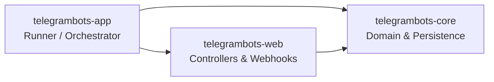
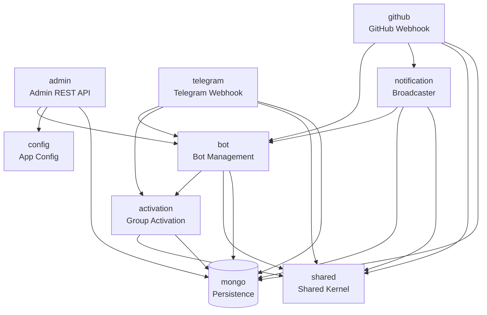

# KIẾN TRÚC QUAN HỆ PHỤ THUỘC & IMPORT GIỮA CÁC MODULE

Tài liệu này giải thích cách các dự án con (submodules/projects) trong codebase `telegrambots` được tổ chức, khai báo import và phụ thuộc lẫn nhau từ cấp độ Maven (build-time) cho đến Spring Modulith (run-time / test-time).

---

## 1. Mô hình Maven Multi-Module (Tái cấu trúc 3 Module)

Để tránh tình trạng dự án bị phân mảnh quá mức (lưa thưa nhiều module nhỏ), codebase đã được tinh giản từ 10 submodules riêng lẻ xuống còn **3 submodules chính** có tính gắn kết cao:

1.  **`telegrambots-core`** ([pom.xml](file:///D:/dev/work/telegrambots/telegrambots-core/pom.xml)):
    *   **Trách nhiệm**: Chứa toàn bộ core business domain logic, cấu hình hệ thống, và cơ sở dữ liệu persistence.
    *   **Được gộp từ**: `shared` (value objects/utils), `config` (properties), `mongo` (persistence), `activation` (logic kích hoạt group), `bot` (registry/management), và `notification` (broadcaster service).
2.  **`telegrambots-web`** ([pom.xml](file:///D:/dev/work/telegrambots/telegrambots-web/pom.xml)):
    *   **Trách nhiệm**: Chứa tất cả các Web/API Entry points (Adapters), Webhook handlers, API controllers và HTTP clients.
    *   **Được gộp từ**: `telegram` (webhook & client API), `github` (webhook pipeline & formatters), và `admin` (admin REST API control panel).
3.  **`telegrambots-app`** ([pom.xml](file:///D:/dev/work/telegrambots/telegrambots-app/pom.xml)):
    *   **Trách nhiệm**: Module khởi chạy chính (Bootstrapper/Runner), chứa cấu hình khởi chạy Spring Boot Application và bộ tích hợp kiểm thử kiến trúc (Spring Modulith verify).

Cơ chế quản lý import ở cấp độ Maven:
*   **Parent POM** ([pom.xml](file:///D:/dev/work/telegrambots/pom.xml)): Quản lý phiên bản chung và cấu hình tập trung `<dependencyManagement>`.
*   **Dòng phụ thuộc Maven**: Tuyến phụ thuộc đi một chiều tuyến tính cực kỳ đơn giản:
    $$\text{telegrambots-app} \longrightarrow \text{telegrambots-web} \longrightarrow \text{telegrambots-core}$$

---

## 2. Sơ đồ Quan hệ Phụ thuộc (Dependency Map)

### Cấp độ Maven Submodule (Build-time)

### Cấp độ Spring Modulith Package (Run-time / Logic-time)
Mặc dù đã gộp thành 3 Maven modules vật lý, ranh giới và mối quan hệ logic giữa các gói nghiệp vụ (Application Modules) vẫn được mô tả và bảo vệ chặt chẽ bởi Spring Modulith:

---

## 3. Cách thức Phân tách và Xử lý Dependency Cycle

Trong quá trình gộp các module con vào `telegrambots-core` và `telegrambots-web`, một chu trình phụ thuộc chéo (dependency cycle) tiềm ẩn giữa lớp nghiệp vụ và lớp giao tiếp đã được phát hiện và xử lý triệt để:

### Vấn đề Chu trình
*   Module `notification` (nằm trong Core) cần gửi tin nhắn đi thông qua client Telegram. Trước đây, nó phụ thuộc trực tiếp vào interface `TelegramSender` khai báo ở module `telegram` (nằm trong Web).
*   Module `telegram` (Web) lại cần phụ thuộc vào `bot` và `activation` (Core) để quản lý cấu hình bot và kích hoạt chat group.
*   Điều này tạo ra một vòng lặp: $\text{Core (notification)} \longrightarrow \text{Web (telegram)} \longrightarrow \text{Core (bot/activation)}$. Maven sẽ không cho phép biên dịch do chu trình này.

### Giải pháp: Dependency Inversion Principle (DIP)
1.  **Di chuyển interface Port**: Di chuyển interface [TelegramSender.java](file:///D:/dev/work/telegrambots/telegrambots-core/src/main/java/com/lede/telegrambots/shared/TelegramSender.java) từ gói `telegram` về gói `shared` (nằm hoàn toàn trong `telegrambots-core`).
2.  **Đảo ngược Dependency**:
    *   Lớp nghiệp vụ `NotificationService` (Core) phụ thuộc vào `TelegramSender` (cùng nằm trong Core).
    *   Lớp adapter hạ tầng `TelegramClient` (nằm trong Web) import `TelegramSender` (Core) để `implements` nó.
3.  **Kết quả**: Tuyến phụ thuộc được kéo thẳng một chiều từ `telegrambots-web` xuống `telegrambots-core`.

---

## 4. Chi tiết các Import cụ thể giữa các Gói Nghiệp vụ

Quy tắc biên giới giữa các gói nghiệp vụ vẫn được cấu hình tại file `package-info.java` ở package gốc của từng module logic:

*   **`shared`**: Không phụ thuộc gói nào.
*   **`config`**: Không phụ thuộc gói nào.
*   **`mongo` (OPEN)**: Cấu hình `Type.OPEN` để các gói khác trực tiếp sử dụng Entity/Repository phục vụ lưu trữ mà không cần viết các Adapter bọc dư thừa.
*   **`activation`**: Cho phép import `{"shared", "mongo"}`.
*   **`bot`**: Cho phép import `{"activation", "shared", "mongo"}`.
*   **`notification`**: Cho phép import `{"bot", "mongo", "shared"}` (đã loại bỏ `telegram` nhờ DIP).
*   **`telegram`**: Cho phép import `{"bot", "activation", "shared", "mongo"}`.
*   **`github`**: Cho phép import `{"bot", "notification", "shared", "mongo"}`.
*   **`admin`**: Cho phép import `{"bot", "config", "mongo"}`.

---

## 5. Cơ chế Tự động Xác thực (Enforcement)

Unit test [ModularityTests.java](file:///D:/dev/work/telegrambots/telegrambots-app/src/test/java/com/lede/telegrambots/ModularityTests.java) (trong `telegrambots-app`) quét toàn bộ cấu trúc package thông qua classpath và tự động báo lỗi build nếu:
1.  Một gói import class từ thư mục con ẩn (internal package) của gói khác (ví dụ: `telegram.command` hoặc `admin.dto`).
2.  Một gói import gói khác nằm ngoài danh sách khai báo `allowedDependencies` trong `package-info.java`.
3.  Phát hiện bất kỳ vòng lặp phụ thuộc nào ở cấp độ package.
