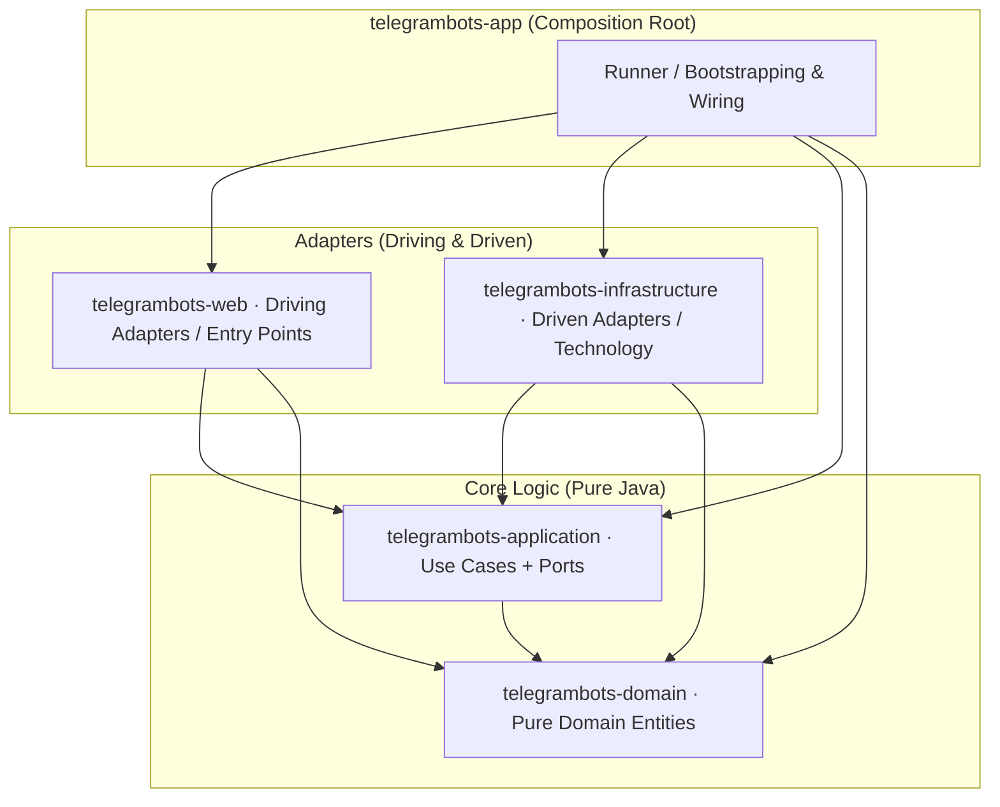
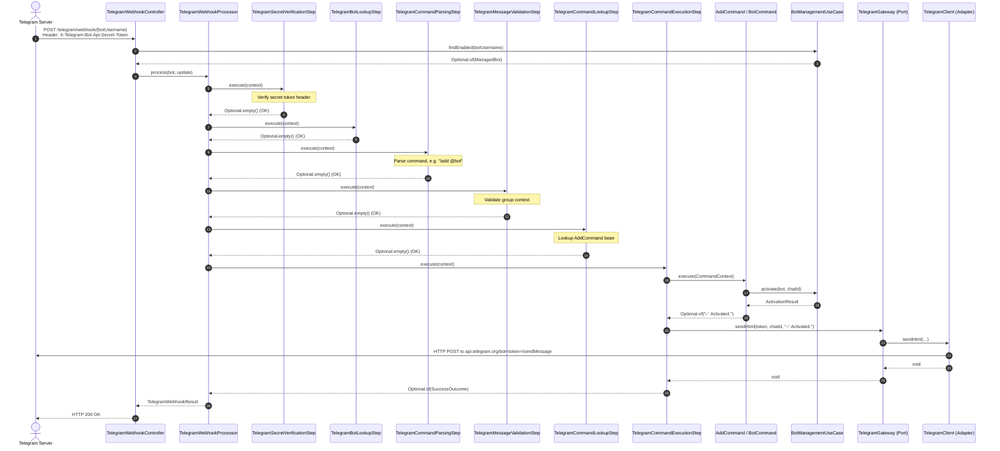
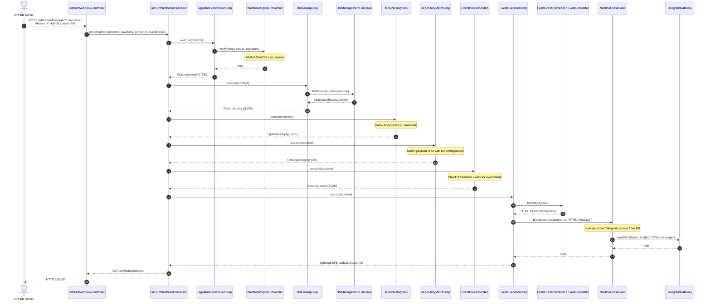
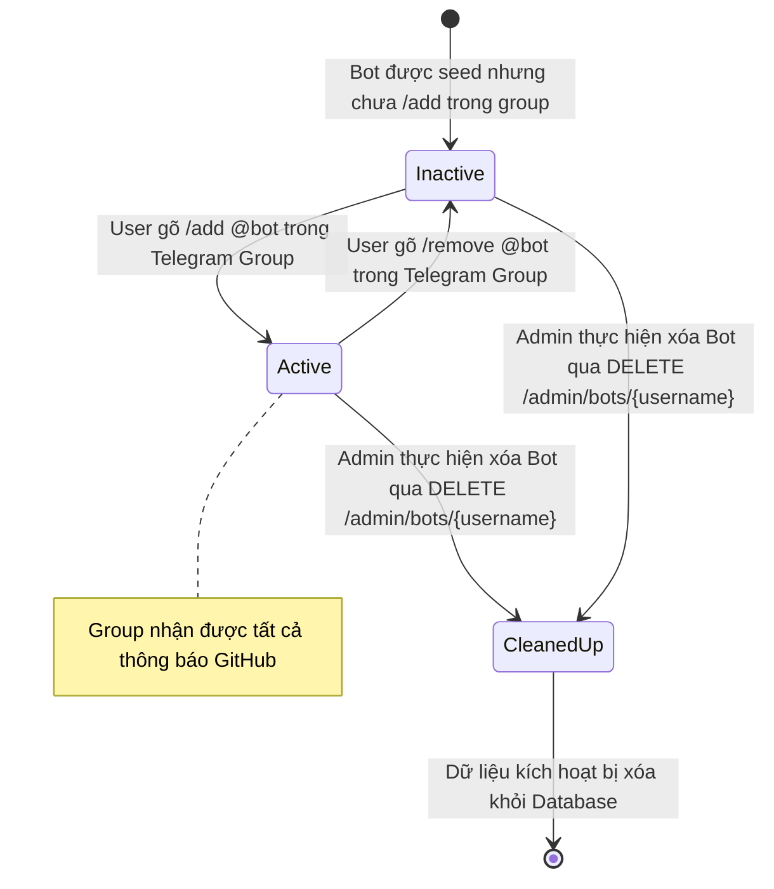

# UML Design — Thiết kế UML toàn bộ codebase

Tài liệu này tổng hợp toàn bộ thiết kế UML (Unified Modeling Language) của hệ thống `telegrambots` dưới dạng Mermaid, phục vụ cho việc nghiên cứu cấu trúc, luồng đi của dữ liệu và mối quan hệ giữa các thành phần.

---

## 1. UML Class Diagram (Sơ đồ Lớp)

Sơ đồ lớp chi tiết của hệ thống phân tách theo 10 Maven submodules nghiệp vụ:

```mermaid
classDiagram
    %% --- Shared & Config Modules ---
    class BotUsername {
        <<record>>
        +String value
        +of(String username) BotUsername
        +isBlank() boolean
    }
    
    class MessageFormatter {
        +escapeHtml(String text) String
    }
    
    class AppProperties {
        <<record>>
        +Admin admin
    }
    
    class AdminProperties {
        <<record>>
        +String token
    }
    AppProperties --> AdminProperties : holds

    %% --- Mongo / Persistence Module ---
    class ManagedBot {
        +String id
        +String username
        +String token
        +String telegramWebhookSecret
        +String githubRepo
        +String githubWebhookSecret
        +boolean enabled
        +Instant createdAt
        +Instant updatedAt
    }
    
    class GroupActivation {
        +String id
        +String botUsername
        +long chatId
        +boolean active
        +Instant activatedAt
        +Instant updatedAt
    }
    
    class ManagedBotRepository {
        <<interface>>
        +findByUsername(String username) Optional~ManagedBot~
        +findAllByEnabledTrue() List~ManagedBot~
    }
    
    class GroupActivationRepository {
        <<interface>>
        +findByBotUsernameAndChatId(String bot, long chat) Optional~GroupActivation~
        +countByBotUsernameAndActiveTrue(String bot) long
        +findAllByBotUsernameAndActiveTrue(String bot) List~GroupActivation~
    }

    %% --- Activation Module ---
    class ActivationStore {
        <<interface>>
        +save(GroupActivation act) GroupActivation
        +find(String bot, long chat) Optional~GroupActivation~
    }
    
    class MongoActivationStore {
        -GroupActivationRepository repository
    }
    MongoActivationStore ..|> ActivationStore : implements
    MongoActivationStore --> GroupActivationRepository : uses
    
    class GroupBotActivationService {
        -GroupActivationRepository repository
        +activate(ManagedBot bot, long chatId) ActivationResult
        +deactivate(ManagedBot bot, long chatId) ActivationResult
        +countActiveGroups(String botUsername) long
    }
    GroupBotActivationService --> GroupActivationRepository : uses

    %% --- Bot Management Module ---
    class BotStore {
        <<interface>>
        +save(ManagedBot bot) ManagedBot
        +findByUsername(String username) Optional~ManagedBot~
    }
    
    class MongoBotStore {
        -ManagedBotRepository repository
    }
    MongoBotStore ..|> BotStore : implements
    MongoBotStore --> ManagedBotRepository : uses

    class BotManagementUseCase {
        <<interface>>
        +upsertBot(BotRegistration reg) ManagedBot
        +findEnabled(String username) Optional~ManagedBot~
        +activate(ManagedBot bot, long chatId) ActivationResult
        +deactivate(ManagedBot bot, long chatId) ActivationResult
    }
    
    class DynamicBotManager {
        -ManagedBotRegistry registry
        -GroupBotActivationService activations
    }
    DynamicBotManager ..|> BotManagementUseCase : implements
    DynamicBotManager --> ManagedBotRegistry : delegates
    DynamicBotManager --> GroupBotActivationService : delegates
    
    class ManagedBotRegistry {
        -ManagedBotRepository bots
        -ConcurrentHashMap runningBots
        +loadEnabledBots() void
        +findEnabled(String username) Optional~ManagedBot~
        +upsert(BotRegistration reg) ManagedBot
    }
    ManagedBotRegistry --> ManagedBotRepository : uses

    %% --- Admin API Module ---
    class AdminAccessGuard {
        -AppProperties properties
        +denyIfUnauthorized(String token) Optional~AccessDenied~
    }
    AdminAccessGuard --> AppProperties : checks
    
    class AdminBotController {
        -AdminAccessGuard guard
        -AdminBotService service
        +createOrUpdateBot(AdminBotRequest request, String token) ResponseEntity
        +listBots(String token) ResponseEntity
    }
    AdminBotController --> AdminAccessGuard : auth
    AdminBotController --> AdminBotService : calls
    
    class AdminBotService {
        -BotManagementUseCase botManager
        -AdminBotMapper mapper
    }
    AdminBotService --> BotManagementUseCase : uses
    AdminBotService --> AdminBotMapper : uses

    %% --- Telegram Module ---
    class TelegramGateway {
        <<interface>>
        +sendHtml(String token, long chatId, String html) void
    }
    
    class TelegramClient {
        -RestClient restClient
    }
    TelegramClient ..|> TelegramGateway : implements

    class TelegramWebhookController {
        -BotManagementUseCase botManager
        -TelegramWebhookProcessor processor
        +handleWebhook(String botUsername, Update update, String secret) ResponseEntity
    }
    TelegramWebhookController --> BotManagementUseCase : looks up
    TelegramWebhookController --> TelegramWebhookProcessor : processes

    class TelegramWebhookProcessor {
        -List~TelegramWebhookStep~ steps
        +process(ManagedBot bot, Update update) TelegramWebhookResult
    }
    TelegramWebhookProcessor --> TelegramWebhookStep : runs in order

    class TelegramWebhookStep {
        <<interface>>
        +execute(TelegramWebhookContext context) Optional~TelegramWebhookResult~
    }
    
    class TelegramSecretVerificationStep {
        +execute() Optional
    }
    class TelegramBotLookupStep {
        +execute() Optional
    }
    class TelegramCommandParsingStep {
        +execute() Optional
    }
    class TelegramMessageValidationStep {
        +execute() Optional
    }
    class TelegramCommandLookupStep {
        +execute() Optional
    }
    class TelegramCommandExecutionStep {
        -TelegramGateway sender
        +execute() Optional
    }
    TelegramSecretVerificationStep ..|> TelegramWebhookStep
    TelegramBotLookupStep ..|> TelegramWebhookStep
    TelegramCommandParsingStep ..|> TelegramWebhookStep
    TelegramMessageValidationStep ..|> TelegramWebhookStep
    TelegramCommandLookupStep ..|> TelegramWebhookStep
    TelegramCommandExecutionStep ..|> TelegramWebhookStep
    TelegramCommandExecutionStep --> TelegramGateway : sends
    
    class BotCommand {
        <<interface>>
        +name() String
        +execute(CommandContext ctx) Optional~String~
    }
    
    class StartCommand {
        +execute() Optional
    }
    class HelpCommand {
        +execute() Optional
    }
    class IdCommand {
        +execute() Optional
    }
    class AddCommand {
        -BotManagementUseCase botManager
        +execute() Optional
    }
    class RemoveCommand {
        -BotManagementUseCase botManager
        +execute() Optional
    }
    class StatusCommand {
        -BotManagementUseCase botManager
        +execute() Optional
    }
    StartCommand ..|> BotCommand
    HelpCommand ..|> BotCommand
    IdCommand ..|> BotCommand
    AddCommand ..|> BotCommand
    RemoveCommand ..|> BotCommand
    StatusCommand ..|> BotCommand
    AddCommand --> BotManagementUseCase : calls
    RemoveCommand --> BotManagementUseCase : calls
    StatusCommand --> BotManagementUseCase : calls
    TelegramCommandExecutionStep --> BotCommand : executes

    %% --- Notification Module ---
    class NotificationService {
        -TelegramGateway sender
        -GroupActivationRepository activations
        +broadcast(String botUsername, String htmlMessage) void
    }
    NotificationService --> TelegramGateway : uses
    NotificationService --> GroupActivationRepository : scans

    %% --- GitHub Module ---
    class WebhookSignatureVerifier {
        <<interface>>
        +verify(byte[] body, String secret, String signature) boolean
    }
    
    class HmacSha256SignatureVerifier {
        +verify() boolean
    }
    HmacSha256SignatureVerifier ..|> WebhookSignatureVerifier : implements

    class GitHubWebhookController {
        -GitHubWebhookProcessor processor
        +handleWebhook(String botUsername, byte[] rawBody, String signature) ResponseEntity
    }
    GitHubWebhookController --> GitHubWebhookProcessor : delegates

    class GitHubWebhookProcessor {
        -List~GitHubWebhookStep~ steps
        +process(String botUsername, byte[] rawBody, String signature, String eventName) GitHubWebhookResult
    }
    GitHubWebhookProcessor --> GitHubWebhookStep : runs in order

    class GitHubWebhookStep {
        <<interface>>
        +execute(GitHubWebhookContext context) Optional~GitHubWebhookResult~
    }
    
    class SignatureVerificationStep {
        -WebhookSignatureVerifier verifier
    }
    class BotLookupStep {
        -BotManagementUseCase botManager
    }
    class PingCheckStep
    class JsonParsingStep {
        -ObjectMapper mapper
    }
    class RepositoryMatchStep
    class EventPresenceStep
    class EventExecutionStep {
        -NotificationService notifier
        -Map~String, EventFormatter~ formatters
    }
    
    SignatureVerificationStep ..|> GitHubWebhookStep
    BotLookupStep ..|> GitHubWebhookStep
    PingCheckStep ..|> GitHubWebhookStep
    JsonParsingStep ..|> GitHubWebhookStep
    RepositoryMatchStep ..|> GitHubWebhookStep
    EventPresenceStep ..|> GitHubWebhookStep
    EventExecutionStep ..|> GitHubWebhookStep
    
    SignatureVerificationStep --> WebhookSignatureVerifier : verify
    BotLookupStep --> BotManagementUseCase : lookup
    EventExecutionStep --> NotificationService : notify
    
    class EventFormatter {
        <<interface>>
        +eventName() String
        +format(JsonNode payload) String
    }
    
    class PushEventFormatter {
        +format() String
    }
    class PullRequestEventFormatter {
        +format() String
    }
    class IssueEventFormatter {
        +format() String
    }
    class IssueCommentEventFormatter {
        +format() String
    }
    class ReleaseEventFormatter {
        +format() String
    }
    class StarEventFormatter {
        +format() String
    }
    class WorkflowRunEventFormatter {
        +format() String
    }
    
    PushEventFormatter ..|> EventFormatter
    PullRequestEventFormatter ..|> EventFormatter
    IssueEventFormatter ..|> EventFormatter
    IssueCommentEventFormatter ..|> EventFormatter
    ReleaseEventFormatter ..|> EventFormatter
    StarEventFormatter ..|> EventFormatter
    WorkflowRunEventFormatter ..|> EventFormatter
    
    EventExecutionStep --> EventFormatter : delegates render
```

---

## 2. UML Component Diagram (Sơ đồ Thành phần)

Sơ đồ thành phần thể hiện ranh giới **5 submodules Maven** theo mô hình **Clean Architecture (Onion / Hexagonal)** và chiều phụ thuộc luôn hướng vào lõi:

---

## 3. UML Sequence Diagrams (Sơ đồ Tuần tự)

Các sơ đồ dưới đây mô tả chi tiết cách các đối tượng cộng tác với nhau tại thời điểm chạy (runtime) để hoàn thành các luồng nghiệp vụ.

### 3.1 Luồng nhận webhook Telegram và xử lý lệnh nhóm (Telegram Command Webhook)

### 3.2 Luồng nhận webhook GitHub và broadcast tin nhắn (GitHub Webhook Broadcast)

---

## 4. UML State Diagram (Sơ đồ Trạng thái)

Sơ đồ này thể hiện vòng đời trạng thái của các nhóm chat kích hoạt bot (`GroupActivation`):

