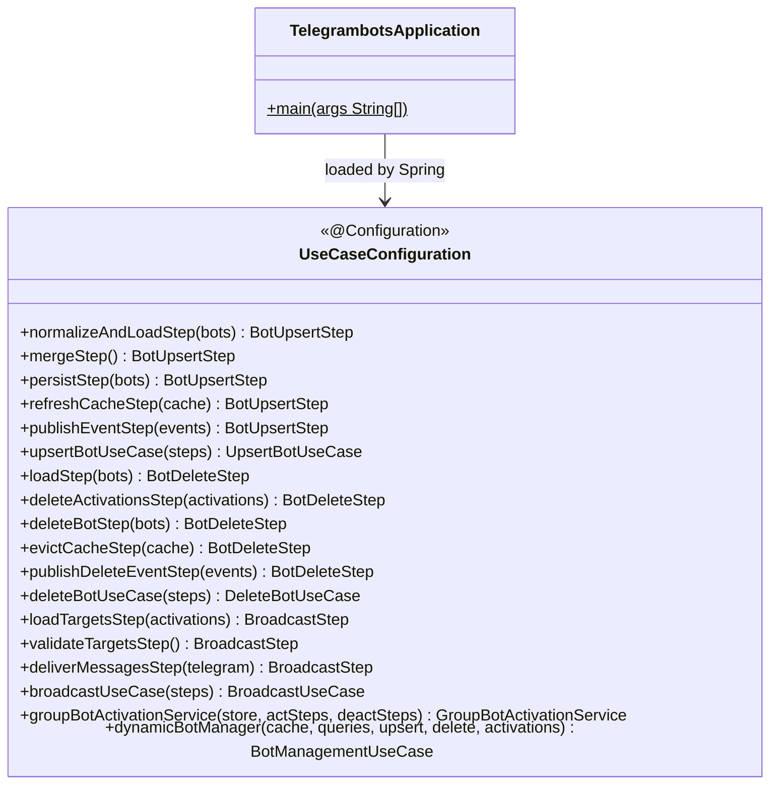

# Package: `com.lede.telegrambots` (App Root)

**Application entry point and composition root.**

## Class Diagram

## Design Notes

- `UseCaseConfiguration` is the **Composition Root** — the only place Spring bean wiring
  occurs for the application layer.
- Steps are declared as `@Bean` methods returning the **marker interface** type so Spring
  builds an ordered `List<MarkerInterface>` for injection into the use case.
- `@Order` on each step bean determines pipeline execution order.
- This pattern keeps all use case classes **framework-free** (plain Java constructors).
