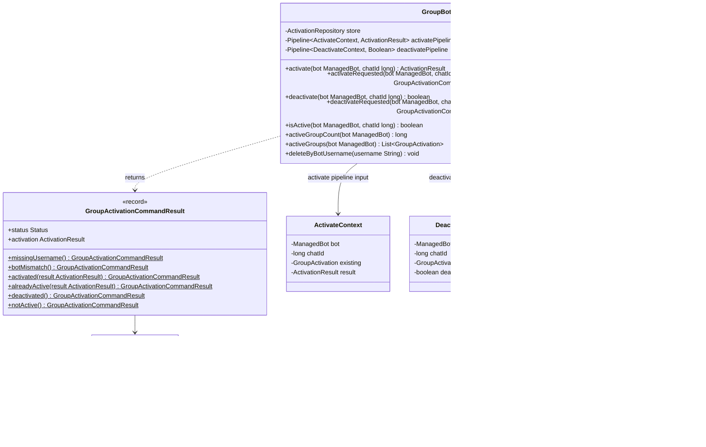

# Package: `com.lede.telegrambots.application.activation`

Group activation use cases — activate/deactivate a bot in a Telegram chat — plus the result object that command handlers render.

## Responsibility

- `GroupBotActivationService`: owns the activate/deactivate `Pipeline`s and the read queries (`isActive`, `activeGroupCount`, `activeGroups`); enforces the `*Requested` validation rules.
- `GroupActivationCommandResult`: application result object describing a command outcome (`Status` + optional `ActivationResult`).
- `ActivateContext` / `DeactivateContext`: mutable pipeline contexts.
- `ActivateGroupStep` / `DeactivateGroupStep`: named `Step` sub-interfaces for type-safe Spring list injection.

## Class Diagram

## Pipelines

- **Activate**: `LoadExistingActivationForActivateStep` → `CheckAlreadyActiveStep` → `SaveActivationStep`.
- **Deactivate**: `LoadExistingActivationForDeactivateStep` → `CheckNotActiveStep` → `SaveDeactivatedStep`.

(Concrete steps live in `application.activation.steps`.)

## Design Notes

- **Application Result Object**: `GroupActivationCommandResult` is an immutable record with named factory methods (`activated`, `alreadyActive`, `botMismatch`, …) and a `Status` enum, so command handlers render outcomes without re-deriving rules.
- **Validation in `*Requested`**: `activateRequested`/`deactivateRequested` reject a blank requested username (`MISSING_USERNAME`) or one targeting a different bot (`BOT_MISMATCH`) before touching the pipeline; matching uses `BotUsername` normalization.
- **Dual constructors**: manual (explicit step list) and Spring-autowired (`List<ActivateGroupStep>` / `List<DeactivateGroupStep>`), same as the bot use cases.
- `activate` throws if the pipeline yields nothing; `deactivate` defaults to `false`.
