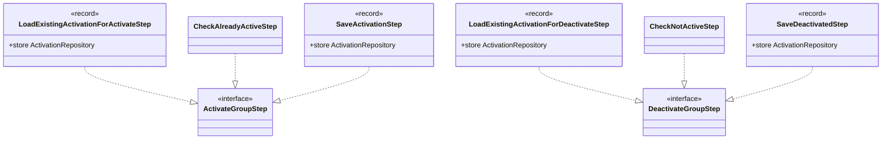

# Package: `com.lede.telegrambots.application.activation.steps`

The concrete pipeline steps for the group **activate** and **deactivate** use cases. Each implements `ActivateGroupStep` or `DeactivateGroupStep` (specializations of `domain.pipeline.Step`).

## Class Diagram

## Activate Pipeline

| # | Step | Action |
|---|---|---|
| 1 | `LoadExistingActivationForActivateStep` | `store.find(username, chatId)` → `ctx.existing` (or null) |
| 2 | `CheckAlreadyActiveStep` | If already active, short-circuit with `ActivationResult(existing, newlyActivated=false)` |
| 3 | `SaveActivationStep` | Create a new `GroupActivation` (or `existing.activate()`), save, return `ActivationResult(saved, true)` |

## Deactivate Pipeline

| # | Step | Action |
|---|---|---|
| 1 | `LoadExistingActivationForDeactivateStep` | `store.find(username, chatId)` → `ctx.existing` (or null) |
| 2 | `CheckNotActiveStep` | If missing or already inactive, short-circuit `false` |
| 3 | `SaveDeactivatedStep` | `existing.deactivate()`, save, return `true` |

## Design Notes

- **Pattern**: Pipeline with explicit short-circuit. The `Check*` steps encode idempotency — they end the run early when there's nothing to do, so `Save*` steps run only on a real state change.
- **Records vs classes**: data-carrying steps (`Load*`, `Save*`) are `record`s holding the `ActivationRepository`; the stateless guards (`CheckAlreadyActiveStep`, `CheckNotActiveStep`) are plain classes.
