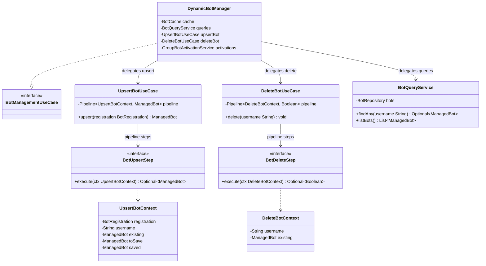

# Package: `com.lede.telegrambots.application.bot`

Bot lifecycle use cases — the facade plus the create/update, delete, and read services. The write paths are pipelines; the read path is a plain service.

## Responsibility

- `DynamicBotManager`: thin facade implementing the inbound `BotManagementUseCase`, routing each call to a focused collaborator.
- `UpsertBotUseCase` / `DeleteBotUseCase`: orchestrate the upsert/delete `Pipeline`s.
- `BotQueryService`: read-side queries (no pipeline).
- `UpsertBotContext` / `DeleteBotContext`: mutable pipeline contexts carrying state between steps.
- `BotUpsertStep` / `BotDeleteStep`: named `Step` sub-interfaces enabling type-safe Spring list injection.

## Class Diagram

## Design Notes

- **Facade**: `DynamicBotManager` holds no business rules — pure routing — so the web layer sees one cohesive entry point.
- **Dual constructors**: each use case has a manual constructor (wires the step list explicitly, used by `UseCaseConfiguration`/tests) and a Spring-autowired constructor that accepts the discovered `List<BotUpsertStep>` / `List<BotDeleteStep>`. Step order is the bean order; the concrete steps live in `application.bot.steps`.
- **Mutable context as accumulator**: `UpsertBotContext` carries `registration → existing → toSave → saved` across steps; `DeleteBotContext` carries `username → existing`.
- `upsert` throws `IllegalStateException` if the pipeline yields no result; `delete` is fire-and-forget (short-circuits silently when the bot is absent).
