# Package: `com.lede.telegrambots.application.bot.steps`

The concrete pipeline steps for the bot **upsert** and **delete** use cases. Each is a `record` implementing the marker interface `BotUpsertStep` or `BotDeleteStep` (both specializations of `domain.pipeline.Step`).

## Class Diagram

```mermaid
classDiagram
    class BotUpsertStep {
        <<interface>>
    }
    class BotDeleteStep {
        <<interface>>
    }

    class NormalizeAndLoadStep {
        <<record>>
        +bots BotRepository
    }
    class MergeStep {
        <<record>>
    }
    class PersistStep {
        <<record>>
        +bots BotRepository
    }
    class RefreshCacheStep {
        <<record>>
        +cache BotCache
    }
    class PublishEventStep {
        <<record>>
        +events DomainEventPublisher
    }

    class LoadStep {
        <<record>>
        +bots BotRepository
    }
    class DeleteActivationsStep {
        <<record>>
        +activations ActivationRepository
    }
    class DeleteBotStep {
        <<record>>
        +bots BotRepository
    }
    class EvictCacheStep {
        <<record>>
        +cache BotCache
    }
    class PublishDeleteEventStep {
        <<record>>
        +events DomainEventPublisher
    }

    NormalizeAndLoadStep ..|> BotUpsertStep
    MergeStep ..|> BotUpsertStep
    PersistStep ..|> BotUpsertStep
    RefreshCacheStep ..|> BotUpsertStep
    PublishEventStep ..|> BotUpsertStep

    LoadStep ..|> BotDeleteStep
    DeleteActivationsStep ..|> BotDeleteStep
    DeleteBotStep ..|> BotDeleteStep
    EvictCacheStep ..|> BotDeleteStep
    PublishDeleteEventStep ..|> BotDeleteStep
```

## Upsert Pipeline Order

| # | Step | Action |
|---|---|---|
| 1 | `NormalizeAndLoadStep` | Normalize username; load existing bot (if any) into the context |
| 2 | `MergeStep` | `ManagedBot.create(...)` when none exists, else `existing.merge(registration)`; set `toSave` |
| 3 | `PersistStep` | Save the bot via `BotRepository`; set `saved` |
| 4 | `RefreshCacheStep` | Push the saved bot into `BotCache` |
| 5 | `PublishEventStep` | Publish `BotSavedEvent` (drives Telegram webhook registration) and return `saved` |

## Delete Pipeline Order

| # | Step | Action |
|---|---|---|
| 1 | `LoadStep` | Find bot by username; short-circuit if not found |
| 2 | `DeleteActivationsStep` | `ActivationRepository.deleteAllFor(username)` — remove every group activation |
| 3 | `DeleteBotStep` | Delete the bot via `BotRepository` |
| 4 | `EvictCacheStep` | Drop the bot from `BotCache` |
| 5 | `PublishDeleteEventStep` | Publish `BotDeletedEvent` (drives webhook de-registration) |

## Design Notes

- **Pattern**: Pipeline. Steps short-circuit by returning a non-empty `Optional`; intermediate steps return `Optional.empty()` to continue. The terminal step returns the result (`saved` / outcome).
- **Records as steps**: each step is an immutable `record` whose components are exactly the outbound ports it needs — no field boilerplate, trivially testable.
- **Ordering is contract**: the sequence above is fixed by `UpsertBotUseCase` / `DeleteBotUseCase` (manual constructor) or by Spring bean order (autowired constructor).
