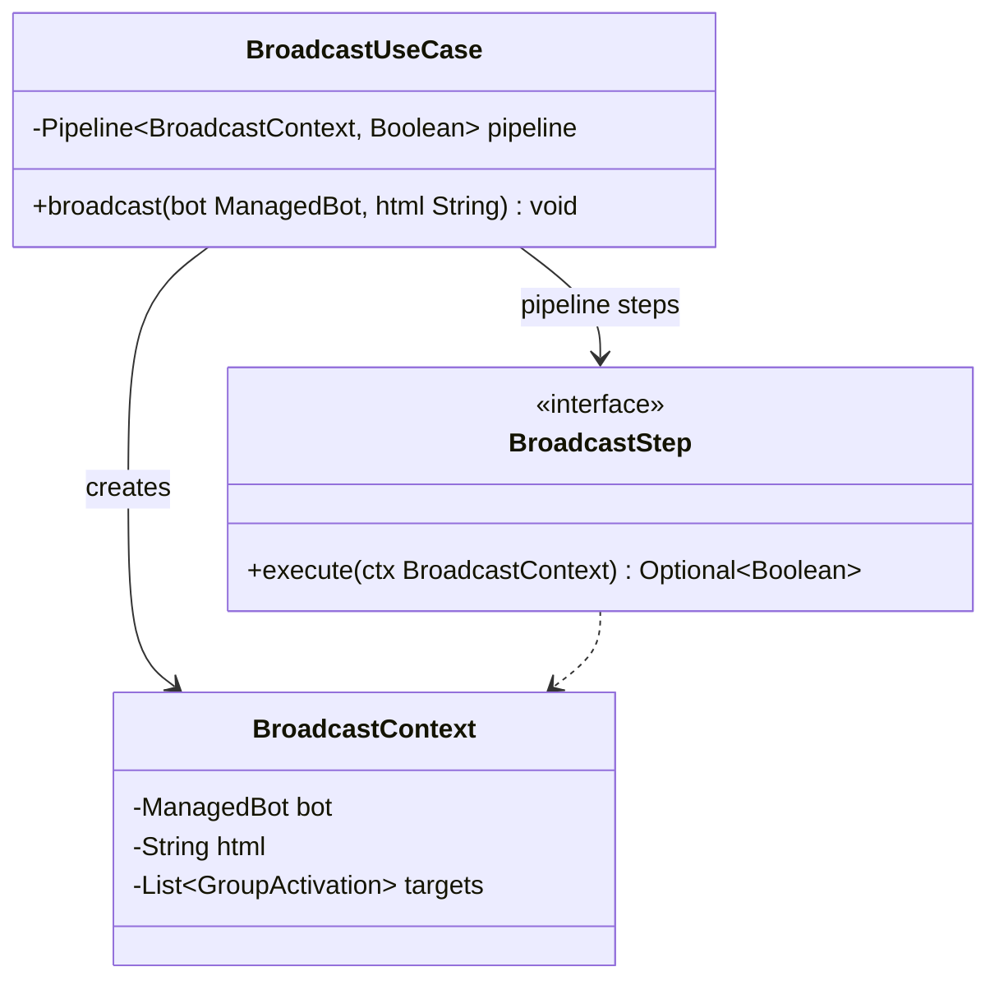

# Package: `com.lede.telegrambots.application.notification`

The broadcast use case — fan a rendered HTML message out to every active Telegram group of a bot.

## Responsibility

- `BroadcastUseCase`: runs the broadcast `Pipeline`.
- `BroadcastContext`: mutable context carrying the bot, the HTML, and the resolved target activations.
- `BroadcastStep`: named `Step` sub-interface for type-safe Spring list injection.

## Class Diagram

## Pipeline Steps (in `notification/steps/`)

| # | Step | Action |
|---|---|---|
| 1 | `LoadTargetsStep` | Query active `GroupActivation`s for the bot; store them in the context |
| 2 | `ValidateTargetsStep` | Short-circuit if there are no targets |
| 3 | `DeliverMessagesStep` | `TelegramGateway.sendHtml(token, chatId, html)` for each target |

## Design Notes

- **Pattern**: Pipeline. `BroadcastContext.targets` is populated by `LoadTargetsStep` and consumed by `DeliverMessagesStep`.
- **Fire-and-forget**: `broadcast` returns `void`; callers (the GitHub webhook flow) don't need per-group delivery results.
- **Dual constructors**: manual (`TelegramGateway` + `ActivationRepository`) and Spring-autowired (`List<BroadcastStep>`).
