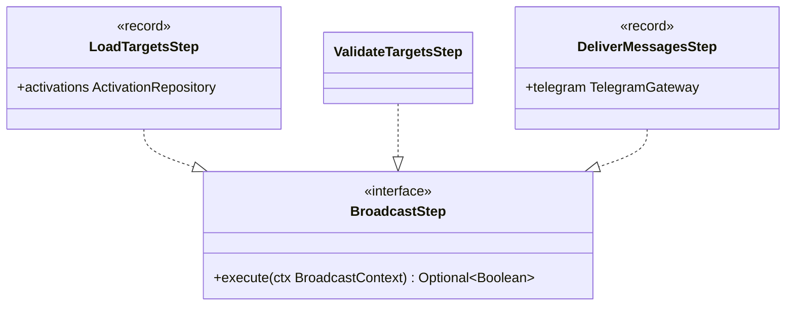

# Package: `com.lede.telegrambots.application.notification.steps`

The concrete steps of the broadcast pipeline. Each implements `BroadcastStep` (a specialization of `domain.pipeline.Step`).

## Class Diagram

## Pipeline

| # | Step | Short-circuits? | Action |
|---|---|---|---|
| 1 | `LoadTargetsStep` | No | `activations.findActive(username)` → `ctx.targets` |
| 2 | `ValidateTargetsStep` | Yes (empty list) | Logs and returns `false` when there are no active groups |
| 3 | `DeliverMessagesStep` | Yes (terminal) | `telegram.sendHtml(token, chatId, html)` per target; returns `true` |

## Design Notes

- **Pattern**: Pipeline. `ValidateTargetsStep` is the guard that keeps `DeliverMessagesStep` from iterating an empty/null target list, and logs the dropped broadcast via `System.Logger`.
- **Records vs classes**: the data-carrying steps (`LoadTargetsStep`, `DeliverMessagesStep`) are `record`s holding their outbound port; the stateless `ValidateTargetsStep` is a plain class.
- **Per-target send**: delivery loops over `ctx.targets`, sending the same HTML to each chat with the bot's token.
