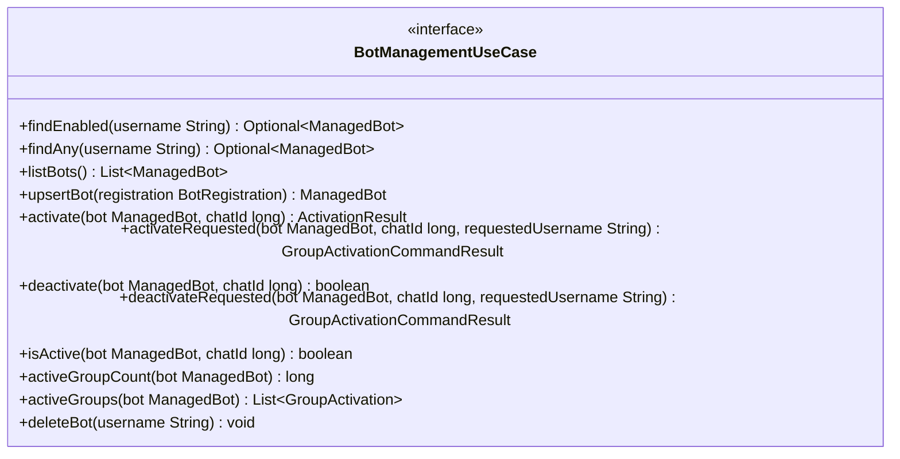

# Package: `com.lede.telegrambots.application.port.in`

The single inbound (driving) port the web layer talks to for all bot management and group activation operations.

## Responsibility

- Define `BotManagementUseCase`: the facade API exposed to driving adapters (REST controllers, webhook/command handlers).
- Speak entirely in domain types (`ManagedBot`, `BotRegistration`, `ActivationResult`, `GroupActivation`) and the application result type `GroupActivationCommandResult`.

## Class Diagram

## Design Notes

- **Pattern**: Facade / inbound port. The web layer depends only on this interface, never on concrete use-case classes.
- `DynamicBotManager` (in `application.bot`) is the sole implementation, routing each call to the focused use case behind it.
- The `*Requested` variants carry the user-typed `@username` so the activation rules can validate the target matches the bot and return a `GroupActivationCommandResult` the web layer just renders.
