# Package: `com.lede.telegrambots.application.port.out`

The outbound (driven) ports the application layer requires from infrastructure. Each is implemented by an `infrastructure.*` `@Component` (Dependency Inversion).

## Responsibility

- Persistence: `BotRepository`, `ActivationRepository`.
- Fast-path read cache: `BotCache`.
- External delivery / crypto / eventing: `TelegramGateway`, `WebhookSignatureVerifier`, `DomainEventPublisher`.

## Class Diagram

```mermaid
classDiagram
    class BotRepository {
        <<interface>>
        +findAll() List~ManagedBot~
        +findByUsername(username String) Optional~ManagedBot~
        +save(bot ManagedBot) ManagedBot
        +deleteByUsername(username String) void
    }
    class ActivationRepository {
        <<interface>>
        +find(botUsername String, chatId long) Optional~GroupActivation~
        +save(activation GroupActivation) GroupActivation
        +isActive(botUsername String, chatId long) boolean
        +countActive(botUsername String) long
        +findActive(botUsername String) List~GroupActivation~
        +deleteAllFor(botUsername String) void
    }
    class BotCache {
        <<interface>>
        +findEnabled(username String) Optional~ManagedBot~
        +put(bot ManagedBot) void
        +evict(username String) void
    }
    class TelegramGateway {
        <<interface>>
        +sendHtml(token String, chatId long, html String) void
    }
    class WebhookSignatureVerifier {
        <<interface>>
        +verify(secret String, signatureHeader String, body byte[]) boolean
    }
    class DomainEventPublisher {
        <<interface>>
        +publish(event Object) void
    }
```

## Design Notes

- **Pattern**: Ports & Adapters (Dependency Inversion). All methods speak domain types — no Mongo/HTTP/Jackson detail leaks inward, so use cases are unit-testable with simple fakes.
- `BotCache` is a fast read path for webhook lookups; `BotRepository` is the source of truth and the cache's fallback on a miss.
- `WebhookSignatureVerifier.verify` returns `true` when the secret is blank/null (verification disabled), otherwise checks the signature header against the raw body bytes.
- `DomainEventPublisher.publish(Object)` hides Spring's `ApplicationEventPublisher`; the web layer's `@EventListener`s react to the published `Bot*Event`s.
