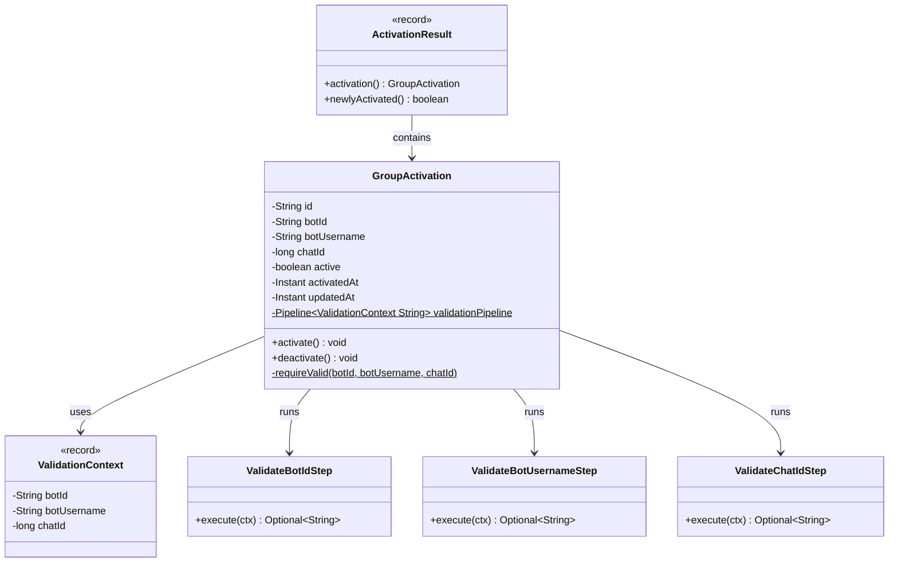

# Package: `domain.activation`

**Group activation** aggregate — binding between a bot and a Telegram chat.

## Class Diagram

## Design Notes

- **Rich Domain Model & Local Pipelines**: All business validations are enforced through a static `Pipeline` (`validationPipeline`) of granular verification steps, throwing an `IllegalArgumentException` with the first encountered error.
- `activate()` / `deactivate()` mutate `active` state and stamp `updatedAt` locally.
- **`ActivationResult`** distinguishes "newly activated now" from "was already active".
