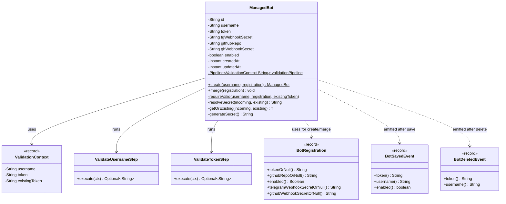

# Package: `domain.bot`

Core **Bot** aggregate of the domain layer.

## Responsibility

Defines the `ManagedBot` entity (root aggregate), input value object `BotRegistration`,
and domain events emitted when a bot's lifecycle changes.

## Class Diagram

## Design Notes

- **Rich Domain Model & Local Pipelines**: Business rules and validation are enforced through an internal `Pipeline` instance (`validationPipeline`). Any failure in the validation chain triggers a short-circuit error string, throwing an `IllegalArgumentException` to prevent the entity from entering an invalid state.
- **`BotRegistration`** uses nullable fields for partial-update semantics (`null` = keep existing).
- Secrets are auto-generated via `UUID` if not provided by the caller.
- Domain events are plain records; publishing is delegated to `DomainEventPublisher`.
