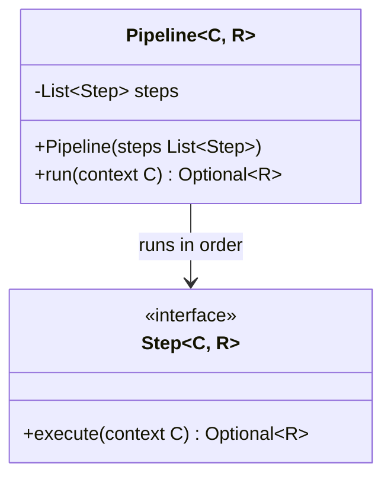

# Package: `com.lede.telegrambots.domain.pipeline`

Framework-free pipeline primitives shared by every multi-step workflow in the system: GitHub/Telegram webhook processing and the bot/activation/broadcast use cases all compose `Step`s into a `Pipeline`.

## Responsibility

- Define `Step<C, R>`: a single unit of work over a context `C` that may short-circuit by returning a result `R`.
- Define `Pipeline<C, R>`: an ordered list of steps, run until the first one produces a result.
- Stay completely framework-free (domain layer) — no Spring, Mongo, or Jackson — so the Maven reactor enforces the inward dependency rule.

## Class Diagram

## Design Notes

- **Pattern**: Pipeline / Chain of Responsibility. `Pipeline.run` iterates steps and returns the first non-empty `Optional<R>`; an all-empty run yields `Optional.empty()`.
- **Short-circuit contract**: a step returns `Optional.empty()` to continue, `Optional.of(value)` to stop and become the pipeline result.
- **Immutability**: the constructor defensively copies via `List.copyOf` and tolerates a `null` list (treated as empty). It accepts `List<? extends Step<C, R>>` so Spring can inject covariant step lists.
- **Constraints**: pure Java + `java.util` only. Both webhook `*Step` aliases and application use-case steps are typed specializations of `Step<C, R>`.
