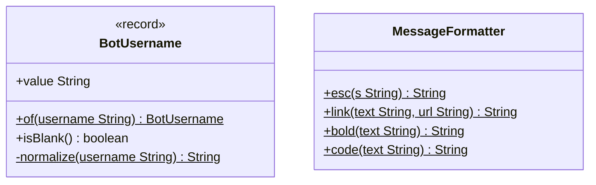

# Package: `com.lede.telegrambots.domain.shared`

Cross-cutting domain vocabulary reused by every other layer without anyone having to depend on a feature package.

## Responsibility

- `BotUsername`: value object that normalizes a Telegram username (`@My_Bot` → `my_bot`): trims, strips leading `@`(s), lowercases (`Locale.ROOT`).
- `MessageFormatter`: pure Telegram HTML formatting helpers (`esc`, `link`, `bold`, `code`) shared by command replies and GitHub event rendering.

## Class Diagram

## Design Notes

- **Value Object**: `BotUsername` normalizes in its compact constructor, so any instance is always canonical; `null` input collapses to an empty value (`isBlank()` true).
- **Utility**: `MessageFormatter` is a `final` class with a private constructor and only `static` methods; every helper routes text through `esc` to prevent HTML injection in Telegram messages.
- **Constraints**: pure Java (`java.util.Locale` only) — no framework dependencies, so all layers can reuse these freely.
