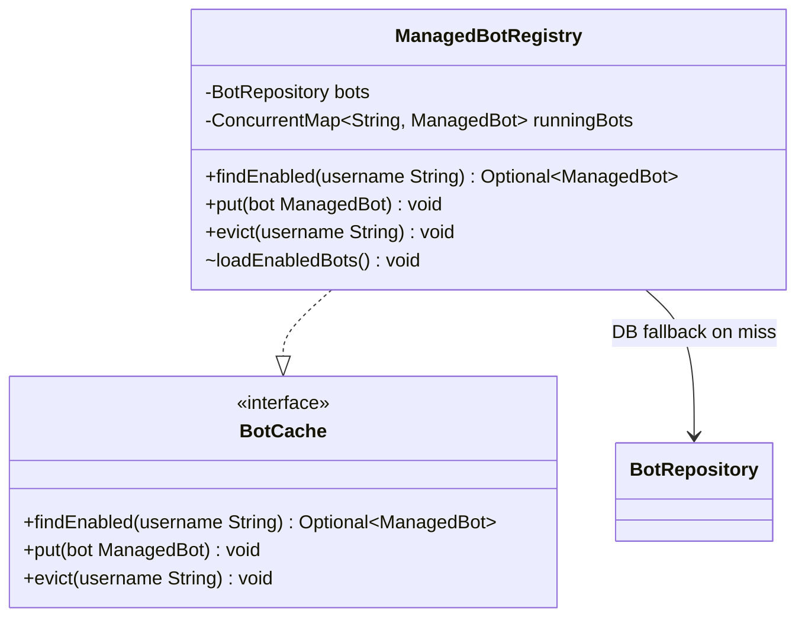

# Package: `com.lede.telegrambots.infrastructure.cache`

The in-memory registry of enabled bots — the infrastructure adapter for the `BotCache` port and the fast path for webhook request routing.

## Class Diagram

## Design Notes

- **Registry / cache-aside**: `loadEnabledBots()` (`@PostConstruct`) warms the map at startup with all enabled bots; on a `findEnabled` miss it falls back to `BotRepository` and caches the result, returning only enabled bots.
- **Thread-safety**: backed by a `ConcurrentHashMap` keyed by normalized `BotUsername`.
- **Kept in sync** by the bot write use cases: `put` on upsert (`RefreshCacheStep`), `evict` on delete (`EvictCacheStep`).
- **Visibility**: package-private `@Component` — only the Spring container and the port abstraction see it.
