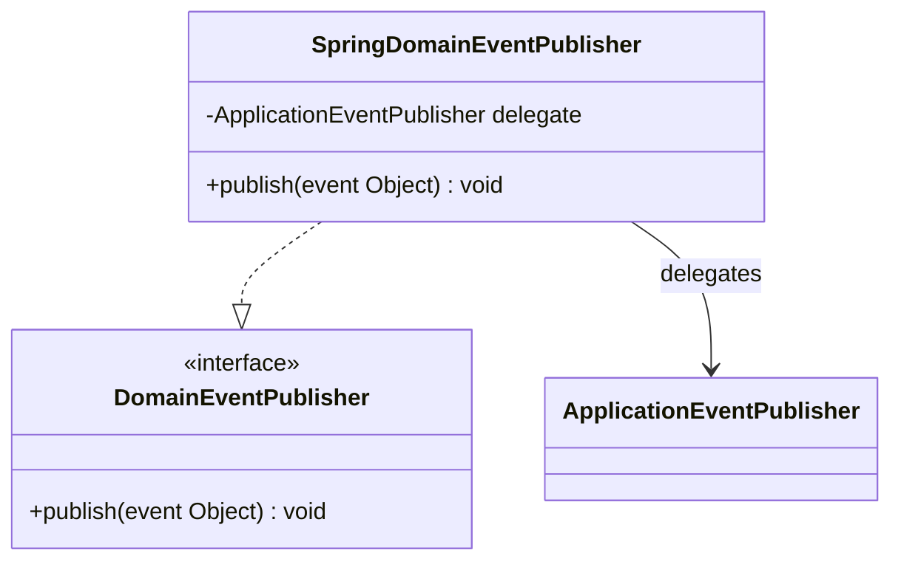

# Package: `com.lede.telegrambots.infrastructure.event`

The Spring event bridge — adapts the `DomainEventPublisher` port to Spring's `ApplicationEventPublisher`.

## Class Diagram

## Design Notes

- **Adapter / anti-corruption**: this is the single place that bridges published `Bot*Event`s onto Spring's event system, keeping the application layer free of Spring.
- Consumers react with `@EventListener` on the Spring side (e.g. `TelegramWebhookManager` registers/de-registers webhooks on `BotSavedEvent`/`BotDeletedEvent`).
- **Visibility**: package-private `@Component`.
