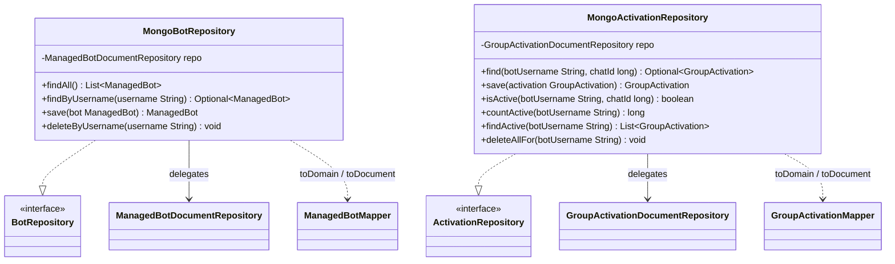

# Package: `com.lede.telegrambots.infrastructure.persistence.mongo`

The MongoDB adapters that implement the application's `BotRepository` and `ActivationRepository` outbound ports.

## Class Diagram

## Design Notes

- **Adapter (Ports & Adapters)**: each `@Component` is the only place that touches its Spring Data `*DocumentRepository`; it delegates queries and maps documents ↔ domain entities via the **static** `*Mapper` methods (mappers are not injected).
- **No business rules**: pure delegation + mapping; the domain entity is never persisted directly (see the `impl` sub-package for the `@Document` twins).
- **Visibility**: package-private `@Component`s — callers depend only on the ports.
