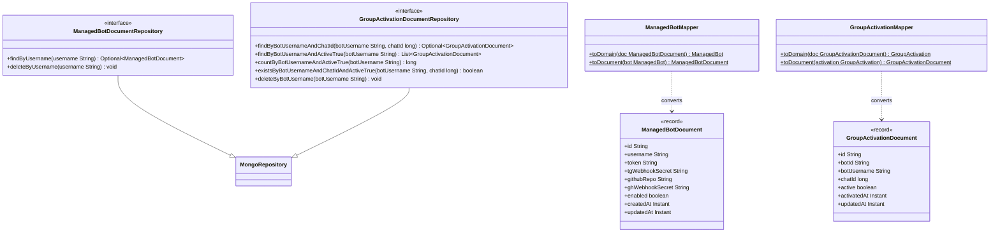

# Package: `com.lede.telegrambots.infrastructure.persistence.mongo.impl`

The MongoDB persistence model: `@Document` record twins of the domain entities, their Spring Data repositories, and the pure mappers between them.

## Class Diagram

## Design Notes

- **Entity ↔ Document split**: documents are framework-coupled `record`s annotated with Spring Data `@Document`; the domain entities stay annotation-free. Mappers keep the two in sync field-for-field.
- **Indexes**: `managed_bots` has a unique index on `username`; `group_activations` has a unique compound index `bot_chat_unique` on `{botUsername, chatId}` plus secondary indexes on `botId`/`botUsername`.
- **Derived queries**: the `*DocumentRepository` interfaces extend `MongoRepository` and rely on Spring Data method-name query derivation (`findByBotUsernameAndActiveTrue`, etc.) — no `@Query` needed.
- **Mappers**: `final` classes with private constructors exposing only `static` `toDomain`/`toDocument` — no Spring injection.
