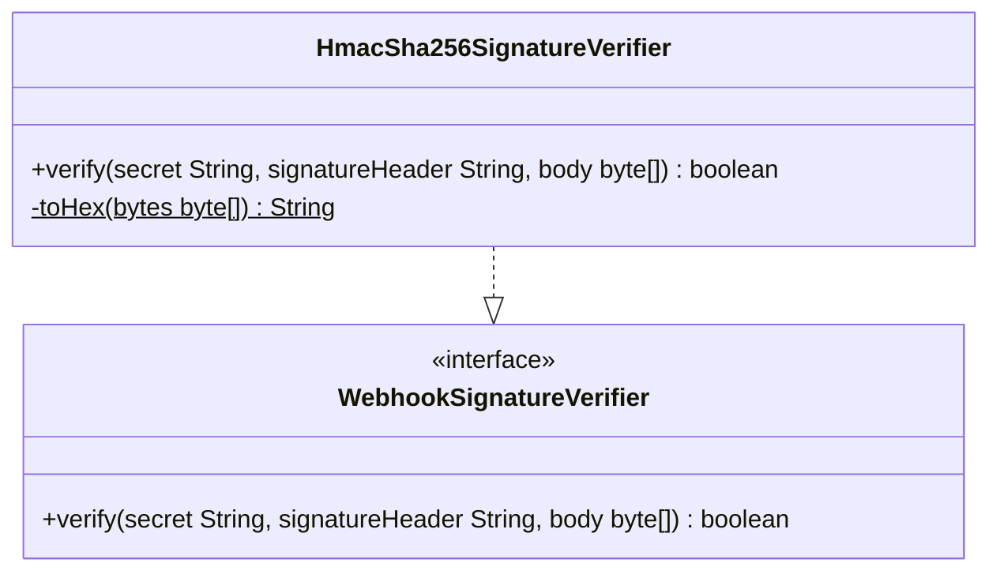

# Package: `com.lede.telegrambots.infrastructure.security`

The HMAC-SHA256 implementation of the `WebhookSignatureVerifier` port, used to authenticate GitHub webhooks.

## Class Diagram

## Design Notes

- **Algorithm**: verifies GitHub's `X-Hub-Signature-256` header — computes `HmacSHA256` over the raw body with the per-bot secret and compares against the `sha256=<hex>` header value.
- **Constant-time comparison**: uses `MessageDigest.isEqual()` to avoid timing attacks.
- **Disabled when no secret**: a blank/`null` secret returns `true` (verification off); a missing or malformed header, or any crypto exception, returns `false`.
- **Visibility**: public `@Component` (its concrete type is referenced from the web layer's wiring).
