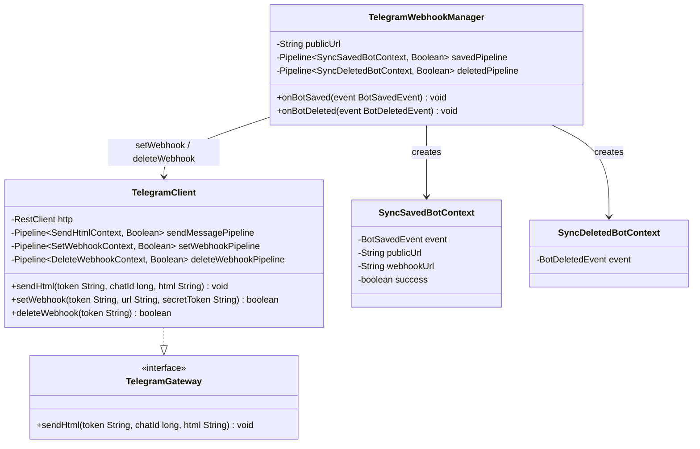

# Package: `com.lede.telegrambots.infrastructure.telegram`

The Telegram Bot API HTTP client (the `TelegramGateway` adapter) plus the event-driven webhook lifecycle manager.

## Class Diagram

## Design Notes

- **Stateless multi-tenant client**: `TelegramClient` holds one `RestClient` (base `https://api.telegram.org`); the bot token is passed per call (`/bot{token}/…`), so a single bean serves every dynamically registered bot.
- **Internal pipelines**: `sendMessage` / `setWebhook` / `deleteWebhook` are each a small `Pipeline` of private inner-record steps, every one guarded first by `ValidateTokenStep` (refuses a blank token). HTTP failures are caught and downgraded to `false` rather than thrown.
- **Event-driven sync**: `TelegramWebhookManager` listens (`@EventListener`) for `BotSavedEvent` / `BotDeletedEvent` and runs the saved/deleted pipelines (steps in `telegram.steps`); `publicUrl` comes from `app.public-url`. Side-effecting external calls justify its place in infrastructure.
- **Dual constructors**: manual (explicit steps + URL) and Spring-autowired (`List<Step<…>>` + `@Value("${app.public-url:}")`).
