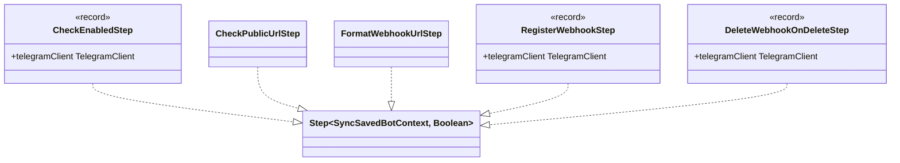

# Package: `com.lede.telegrambots.infrastructure.telegram.steps`

The webhook-lifecycle pipeline steps consumed by `TelegramWebhookManager`. Each implements `domain.pipeline.Step` over a sync context and is an ordered Spring `@Component`.

## Class Diagram

## Saved Pipeline (on `BotSavedEvent`)

| `@Order` | Step | Short-circuits? | Action |
|---|---|---|---|
| 1 | `CheckEnabledStep` | Yes (disabled) | Bot disabled → `deleteWebhook`, return `false` |
| 2 | `CheckPublicUrlStep` | Yes (blank URL) | No `app.public-url` → log warning, return `false` |
| 3 | `FormatWebhookUrlStep` | No | Build `{publicUrl}/telegram/webhook/{username}` into the context |
| 4 | `RegisterWebhookStep` | Yes (terminal) | `TelegramClient.setWebhook(token, url, secret)`; return its result |

## Deleted Pipeline (on `BotDeletedEvent`)

| `@Order` | Step | Action |
|---|---|---|
| 1 | `DeleteWebhookOnDeleteStep` | `TelegramClient.deleteWebhook(token)` |

## Design Notes

- **Ordering via `@Order`**: bean order (`@Order(1..4)`) defines the saved-pipeline sequence when steps are autowired as `List<Step<SyncSavedBotContext, Boolean>>`.
- **Records vs classes**: steps needing the `TelegramClient` (`CheckEnabledStep`, `RegisterWebhookStep`, `DeleteWebhookOnDeleteStep`) are `record`s; the pure-logic steps (`CheckPublicUrlStep`, `FormatWebhookUrlStep`) are plain classes.
- **Mutable sync context**: `FormatWebhookUrlStep` writes `webhookUrl`, which `RegisterWebhookStep` reads — classic accumulate-then-act pipeline.
