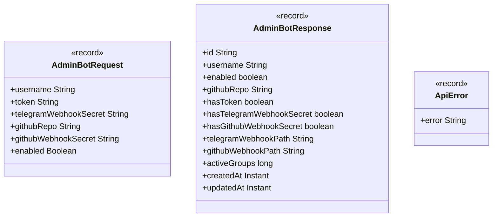

# Package: `com.lede.telegrambots.admin.dto`

The request/response DTOs for the admin REST API. All are immutable Java records.

## Class Diagram

## Design Notes

- **Secrets never leave the server**: `AdminBotResponse` exposes only `hasToken` / `hasTelegramWebhookSecret` / `hasGithubWebhookSecret` booleans plus the computed webhook *paths* — never the raw token or secrets.
- **Plain carriers**: these records hold no behavior; the `admin.impl.AdminBotMapper` converts `AdminBotRequest` → domain `BotRegistration` and `ManagedBot` → `AdminBotResponse`.
- `ApiError(error)` is the uniform error body returned for 4xx responses.
