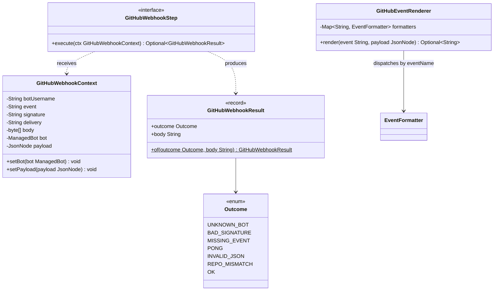

# Package: `com.lede.telegrambots.github`

The GitHub webhook processing root types: the typed pipeline step alias, its mutable context, the web-agnostic result, and the event renderer.

## Class Diagram

## Design Notes

- **Typed pipeline alias**: `GitHubWebhookStep extends Step<GitHubWebhookContext, GitHubWebhookResult>` so the webhook steps form a distinct bean group Spring injects as `List<GitHubWebhookStep>`.
- **Mutable context**: `GitHubWebhookContext` carries immutable request inputs plus `bot` and `payload`, which steps populate progressively.
- **Web-agnostic result**: `GitHubWebhookResult(Outcome, body)` keeps Spring MVC types out of the processing rules; only the controller maps `Outcome` → HTTP status.
- **Renderer (Strategy dispatcher)**: `GitHubEventRenderer` builds a `Map<eventName, EventFormatter>` from the injected formatter beans and returns the formatted HTML (or empty when no formatter matches / the formatter drops the payload).
