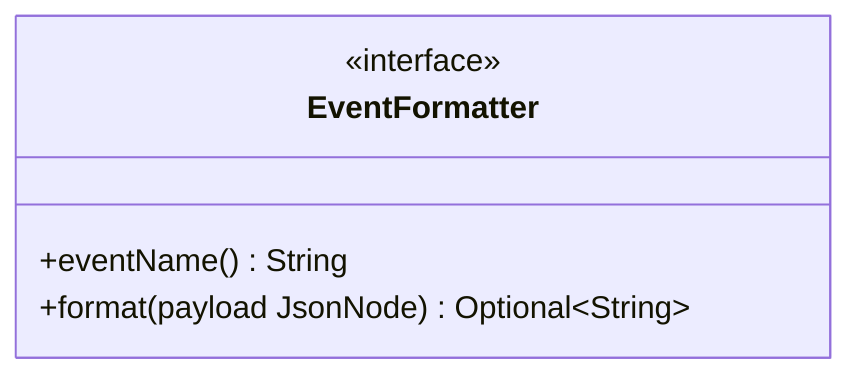

# Package: `com.lede.telegrambots.github.formatter`

The `EventFormatter` strategy interface — the contract every GitHub event renderer implements. Concrete implementations live in the `impl` sub-package.

## Class Diagram

## Design Notes

- **Strategy**: each implementation declares the GitHub event name it handles (matched against the `X-GitHub-Event` header) and renders the payload into a Telegram HTML string.
- **Self-registering**: implementations are Spring beans; `GitHubEventRenderer` collects them into a `Map` keyed by `eventName()`. Adding an event type = adding one bean — no central registry to edit.
- **Drop semantics**: `format` returns `Optional.empty()` to silently ignore uninteresting action variants.
- See [`impl/README.md`](impl/README.md) for the concrete formatters and their event map.
