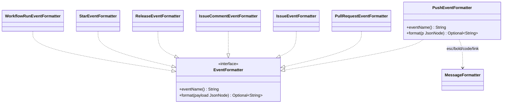

# Package: `github.formatter.impl`

Concrete **`EventFormatter` strategies** — one per GitHub event type — that turn a webhook payload into a Telegram HTML message.

## Responsibility

Each class handles a single GitHub event (matched by `eventName()` against the `X-GitHub-Event` header), reads the relevant fields from the Jackson `JsonNode` payload, and renders a Telegram HTML string. Returning `Optional.empty()` silently drops action variants the bot doesn't announce.

## Class Diagram

## Event → Formatter Map

| `eventName()` | Class | Emits when (else dropped) |
|---|---|---|
| `push` | `PushEventFormatter` | ≥1 commit; shows up to 5, then a "…N khác" compare link |
| `pull_request` | `PullRequestEventFormatter` | `opened` / `reopened` / `closed` (merged vs closed) / `ready_for_review` |
| `issues` | `IssueEventFormatter` | `opened` / `reopened` / `closed` |
| `issue_comment` | `IssueCommentEventFormatter` | `created` only |
| `release` | `ReleaseEventFormatter` | `published` only; falls back to `tag_name` when name is blank |
| `star` | `StarEventFormatter` | `created` only; includes total stargazer count |
| `workflow_run` | `WorkflowRunEventFormatter` | `completed`; icon by `conclusion` (✅/❌/⚪/ℹ️) |

## Design Notes

- **Pattern**: Strategy. Each formatter is a package-private `@Component`; Spring injects the full `List<EventFormatter>` into `GitHubEventRenderer`, which dispatches by `eventName()`. Adding an event = adding one class — no central switch to edit.
- **Pure rendering**: formatters only read the payload and build a string via the domain `MessageFormatter` helpers (`esc`/`bold`/`code`/`link`); all user text is HTML-escaped. No I/O, no broadcasting — sending is `BroadcastUseCase`'s job.
- **Drop semantics**: `Optional.empty()` means "ignore this action variant", keeping noisy webhook actions out of the chat.
- **Constraints**: depends on Spring (`@Component`) and Jackson 3 (`tools.jackson.databind.JsonNode`) — correct for the web layer; reuses the framework-free `domain.shared.MessageFormatter`.
