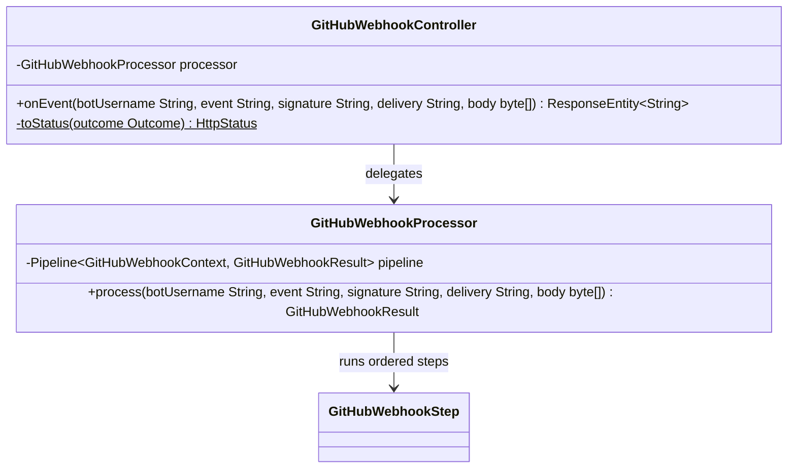

# Package: `com.lede.telegrambots.github.impl`

The GitHub webhook HTTP adapter and its pipeline-driven processor.

## Class Diagram

## Outcome → HTTP Status

| Outcome | Status |
|---|---|
| `UNKNOWN_BOT` | 404 Not Found |
| `BAD_SIGNATURE` | 401 Unauthorized |
| `MISSING_EVENT`, `INVALID_JSON` | 400 Bad Request |
| `PONG`, `REPO_MISMATCH`, `OK` | 200 OK |

## Design Notes

- **Application Service + Result Object**: `GitHubWebhookProcessor` (`@Service`) owns the `Pipeline<GitHubWebhookContext, GitHubWebhookResult>` (injected `List<GitHubWebhookStep>` ordered by `@Order`) and returns a web-agnostic `GitHubWebhookResult`. If no step short-circuits it defaults to `OK`.
- **Thin controller**: `GitHubWebhookController` (`POST /github/webhook/{botUsername}`) only extracts headers/body, calls the processor, and maps `Outcome` to an HTTP status — no business logic.
- **Visibility**: the processor is package-private; the controller is public.
