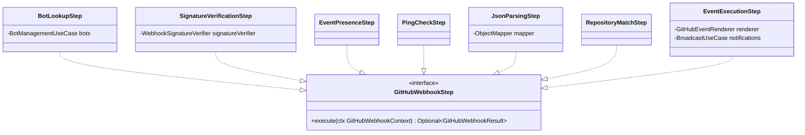

# Package: `com.lede.telegrambots.github.steps`

The ordered steps of the GitHub webhook pipeline. Each is a `@Component` implementing `GitHubWebhookStep` and short-circuits by returning a `GitHubWebhookResult`.

## Class Diagram

## Pipeline Execution Order (`@Order`)

| # | Step | Short-circuit outcome | Action |
|---|---|---|---|
| 1 | `BotLookupStep` | `UNKNOWN_BOT` (404) | `findEnabled(botUsername)`; store `ctx.bot` or reject |
| 2 | `SignatureVerificationStep` | `BAD_SIGNATURE` (401) | Verify `X-Hub-Signature-256` against the bot's `ghWebhookSecret` over the raw body |
| 3 | `EventPresenceStep` | `MISSING_EVENT` (400) | Require the `X-GitHub-Event` header |
| 4 | `PingCheckStep` | `PONG` (200) | Answer GitHub's `ping` handshake |
| 5 | `JsonParsingStep` | `INVALID_JSON` (400) | Parse body bytes → `JsonNode` into `ctx.payload` |
| 6 | `RepositoryMatchStep` | `REPO_MISMATCH` (200) | Drop events whose `repository.full_name` ≠ the bot's configured repo (blank repo = match all) |
| 7 | `EventExecutionStep` | `OK` (200) | `GitHubEventRenderer.render(...)` → `BroadcastUseCase.broadcast(...)`; always terminal |

## Design Notes

- **Pattern**: Pipeline / Chain of Responsibility, ordered by `@Order(1..7)`; the first step to return a non-empty result wins.
- **Order matters**: bot lookup precedes signature verification because the secret is per-bot; JSON parsing precedes repo matching because the match reads the parsed payload.
- **Terminal step**: `EventExecutionStep` catches and logs broadcast errors but still returns `OK`, so a formatter/broadcast failure never turns into a GitHub delivery retry storm.
