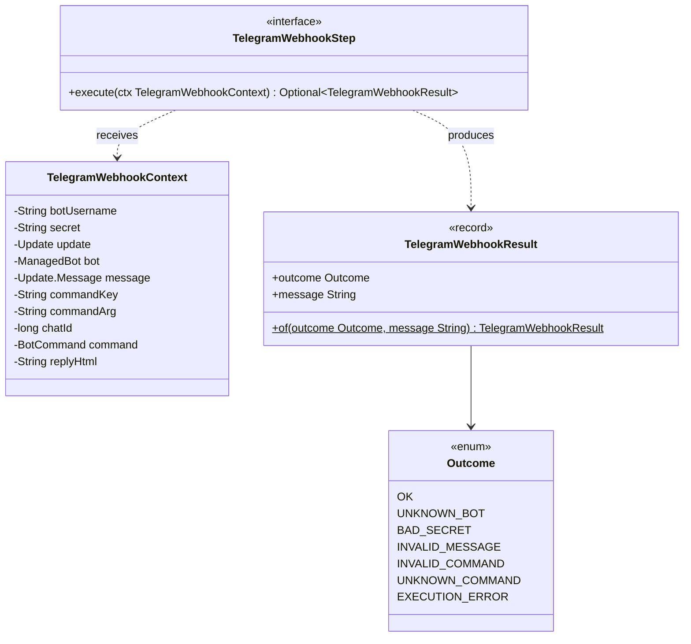

# Package: `com.lede.telegrambots.telegram`

The Telegram webhook processing root types: the typed pipeline step alias, its mutable context, and the web-agnostic result.

## Class Diagram

## Design Notes

- **Typed pipeline alias**: `TelegramWebhookStep extends Step<TelegramWebhookContext, TelegramWebhookResult>`, injected as `List<TelegramWebhookStep>`.
- **Mutable context, progressively enriched**: lookup sets `bot`; validation sets `message`/`chatId`; parsing sets `commandKey`/`commandArg`; command lookup sets `command`; execution sets `replyHtml`.
- **Web-agnostic result**: `TelegramWebhookResult(Outcome, message)` keeps Spring MVC types out of processing; the controller maps `Outcome` → HTTP status.
