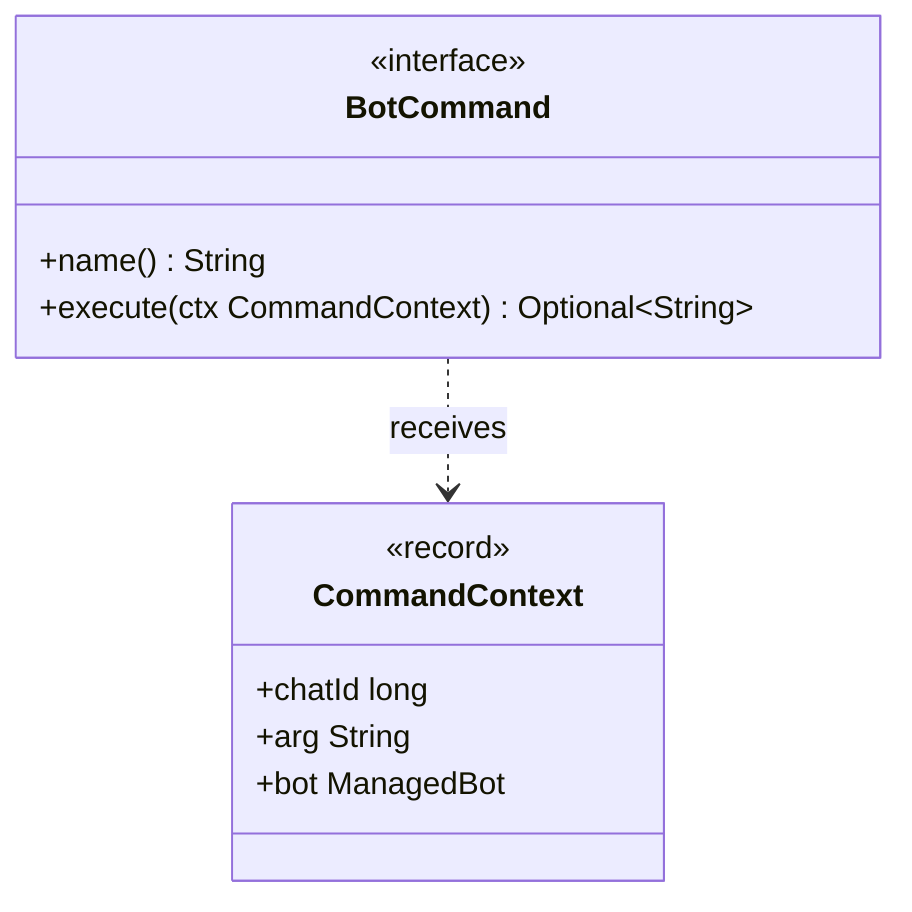

# Package: `com.lede.telegrambots.telegram.command`

The Telegram slash-command abstraction: the `BotCommand` interface and its immutable input context. Concrete commands live in the `impl` sub-package.

## Class Diagram

## Design Notes

- **Command (pure)**: `execute` maps a `CommandContext` to an optional HTML reply (`Optional.empty()` = stay silent) and must not throw. Commands have **zero transport coupling** — they never inject a sender; `TelegramCommandExecutionStep` performs the single send.
- **Auto-discovery**: implementations are Spring beans; `TelegramCommandLookupStep` indexes them by `name()` (the keyword incl. leading slash, e.g. `/add`). Adding a command never widens coupling (Open/Closed).
- **`CommandContext` invariants**: `arg` is normalized to `""` when null; `bot` must be non-null. Every command resolves its token/repo/identity through `bot` — no global config.
