# Package: `telegram.command.impl`

**Concrete Telegram bot command implementations.**

## Class Diagram

```mermaid
classDiagram
    class BotCommand {
        <<interface>>
        +name() String
        +execute(ctx CommandContext) Optional~String~
    }

    class AddCommand {
        -Pipeline~AddCommandContext String~ pipeline
        +name() String
        +execute(ctx) Optional~String~
    }

    class AddCommandContext {
        -CommandContext commandContext
        -String requestedUsername
        -ActivationResult result
    }

    class ValidateAddArgStep
    class CheckBotNameMatchStep
    class ActivateBotStep {
        -BotManagementUseCase bots
    }

    class RemoveCommand {
        -Pipeline~RemoveCommandContext String~ pipeline
        +name() String
        +execute(ctx) Optional~String~
    }

    class RemoveCommandContext {
        -CommandContext commandContext
        -String requestedUsername
    }

    class ValidateRemoveArgStep
    class DeactivateBotStep {
        -BotManagementUseCase bots
    }

    class StatusCommand {
        -BotManagementUseCase bots
    }
    class HelpCommand
    class IdCommand
    class StartCommand

    class ActivationCommandPresenter {
        +toHtml(result, bot) String$
    }

    AddCommand ..|> BotCommand
    RemoveCommand ..|> BotCommand
    StatusCommand ..|> BotCommand
    HelpCommand ..|> BotCommand
    IdCommand ..|> BotCommand
    StartCommand ..|> BotCommand

    AddCommand --> ValidateAddArgStep : step 1
    AddCommand --> CheckBotNameMatchStep : step 2
    AddCommand --> ActivateBotStep : step 3

    RemoveCommand --> ValidateRemoveArgStep : step 1
    RemoveCommand --> DeactivateBotStep : step 2
```

## Command Summary

| Command | Pipeline | Description |
|---|---|---|
| `/add @bot` | 3 steps | Activate bot in current group |
| `/remove @bot` | 2 steps | Deactivate bot in current group |
| `/status` | No | Show bot status and group count |
| `/id` | No | Return current chat ID |
| `/start` | No | Greeting message |
| `/help` | No | List all available commands |

`ActivationCommandPresenter` formats `GroupActivationCommandResult` into HTML reply strings.
