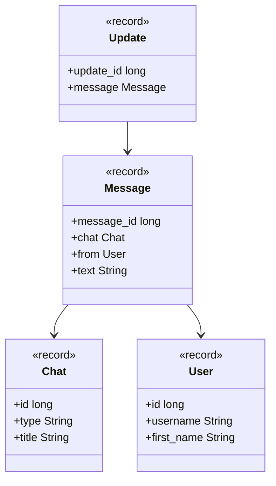

# Package: `com.lede.telegrambots.telegram.dto`

The inbound Telegram `Update` DTO — mirrors the subset of the Telegram Bot API webhook payload the bot consumes.

## Class Diagram

## Design Notes

- **Nested records**: `Update` and its `Message` / `Chat` / `User` are immutable records using snake_case component names matching the wire JSON.
- **Lenient parsing**: every record is annotated `@JsonIgnoreProperties(ignoreUnknown = true)` so unmodeled Telegram fields are dropped instead of failing deserialization.
- Only the fields needed for command processing are modeled (chat id/type, sender, message text).
