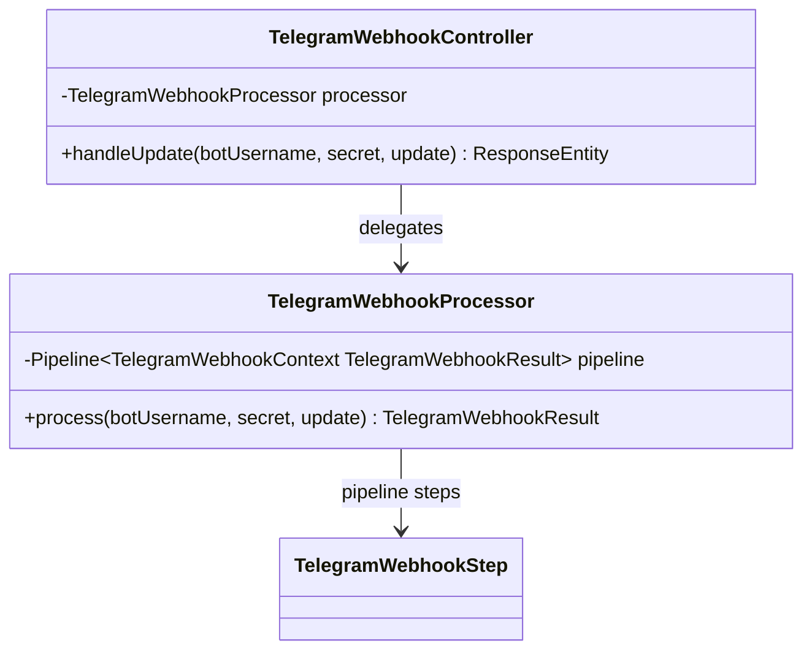

# Package: `telegram.impl`

**Telegram webhook controller and processor.**

## Class Diagram

## Design Notes

- Entry URL: `POST /telegram/webhook/{botUsername}`
- `X-Telegram-Bot-Api-Secret-Token` header is extracted and passed as `secret`.
- Controller maps outcome to appropriate HTTP status codes.
