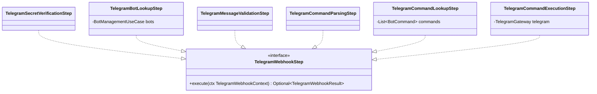

# Package: `telegram.steps`

**Telegram webhook pipeline steps.**

## Class Diagram

## Pipeline Execution Order

| # | Step | Short-circuits as | Action |
|---|---|---|---|
| 1 | `TelegramSecretVerificationStep` | `REJECTED` | Validate `X-Telegram-Bot-Api-Secret-Token` |
| 2 | `TelegramBotLookupStep` | `REJECTED` | Load enabled bot from cache; set `ctx.bot` |
| 3 | `TelegramMessageValidationStep` | `IGNORED` | Ensure `update.message.text` is present |
| 4 | `TelegramCommandParsingStep` | `IGNORED` | Extract `/command` and `arg` from text |
| 5 | `TelegramCommandLookupStep` | `IGNORED` | Find matching `BotCommand`; set `ctx.command` |
| 6 | `TelegramCommandExecutionStep` | `OK` | Run command; send reply via `TelegramGateway` |
